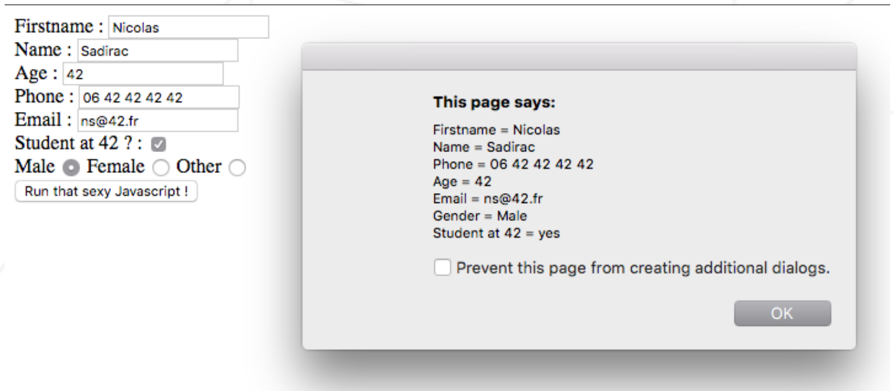
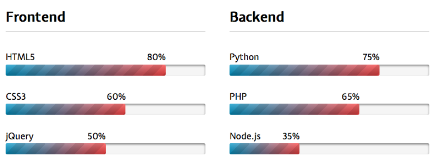

# **D00 - Piscine Python-Django**

## 웹 기초

_요약: 첫날엔 웹 개발에 친숙해질 수 있는 시간을 드립니다. 다음과 같은 메뉴를 맛보세요 : HTTP, HTML, CSS, 페이지 내의 Javascript 스크립트 통합하기._

##### _번역 오류 및 오역 제보는 42seoul_club_translate 채널 또는 @jiychoi 로 연락주세요._

<br>

# Contents

| Chapter | Contents                       | page |
| :-----: | :----------------------------- | :--: |
|    1    | [**Preamble**](#Chapter-1)     |  2   |
|    2    | [**Instructions**](#Chapter-2) |  3   |
|    3    | [**Exercise 00**](#Chapter-3)  |  4   |
|    3    | [**Exercise 01**](#Chapter-4)  |  5   |
|    3    | [**Exercise 02**](#Chapter-5)  |  6   |
|    3    | [**Exercise 03**](#Chapter-6)  |  8   |
|    3    | [**Exercise 04**](#Chapter-7)  |  9   |
|    3    | [**Exercise 05**](#Chapter-8)  |  10  |

<br>

# **Chapter 1**

## Preamble

<br>

다음 내용은 위키피디아에 적힌 _Balaenoptera musculus_ 의 설명입니다.

대왕고래 (Balaenopter musculus) 는 수염고래소목 수염고래과에 속하는 해양 포유류입니다. 기록상 최대 크기는 길이 29.9미터 (98피트), 무게 177 미터톤 (190톤) 으로 현존하는 동물들 중 최대 크기입니다.

현재 해양 포유류 협회 분류위원회에 인정받은 5종의 대왕고래 아종이 있습니다: 북대서양과 북태평양의 _B. m. musculus_, 남쪽 바다에 서식하는 _B. m. intermedia_, 인도양과 남태평양에 서식하는 _B. m. brevicauda_ (피그미 대왕고래), 북인도양에 서식하는 _B. m. indica_, 마지막으로 칠레의 바다에 사는 _B. m. unnamed subsp_ 입니다. 대왕고래의 먹이 대부분은 난바다곤쟁이 (크릴) 로 구성되어 있습니다.

19세기 말까지 대왕고래는 거의 대부분의 바다에서 널리 서식하고 있었습니다. 허나 1967년에 국제포경위원회에 의해 모든 대왕고래 사냥이 금지되기 전까지 상당히 많은 대왕고래가 사냥당해 멸종 직전까지 개체 수가 줄기도 했습니다. 국제포경위원회의 자료에 의하면, 1868년부터 1978년까지 약 100년간 382,595마리의 대왕고래가 붙잡혔습니다. 전세계의 대왕고래 분포는 약 10,000 ~ 25,000마리 정도로 추정되며, 세부적으로는 태평양 북동쪽에 1,647마리, 태평양 북쪽 중부에 63 ~ 133마리, 북대서양에 1000 ~ 2000마리, 남극해에 2,280마리, 뉴질랜드 인근에 718마리, 북인도양에 270마리, 칠레에 570 ~ 760마리가 보고된 바 있습니다. 현재는 멸종위기종으로 지정되어 보호되고 있습니다.

이 서브젝트가 작성되면서 피해를 입은 고래는 없으니 안심하세요.

<br>

# **Chapter 2**

## Instructions

##### _역주: 원본은 OCaml Piscine 관련 내용이 적혀있기 때문에, 다른 서브젝트에서 Python Piscine 관련 Instruction을 가져왔습니다._

<br>

노골적인 모순이 없는 이상, 해당 지침은 Python Django Piscine 모든 날짜에 적용됩니다.

- 이 페이지에 있는 내용만이 레퍼런스로 적용됩니다. 루머를 믿지 마세요!

- 조심하세요! 과제를 제출하기 한 시간 전까지도 해당 문서는 변경될 수 있습니다.

- 이번 과제들은 난이도별로 배치되어 있습니다 - 쉬운 것부터 어려운 것 까지요. 만약 쉬운 과제가 제대로 작동하지 않으면, `우리는 절 대` 어려운 과제를 (완벽하게 구현하였더라도) 채점하지 않을 것입니다.

- 파일과 디렉토리에 적절한 권한 설정을 해 주었는지 확인하세요.

- 각 과제별로 제출 필수사항을 지키셔야 합니다.

- 여러분의 과제는 같은 피씨너들에게 채점받고 점수가 매겨질 것입니다.

- 그리고 그 뒤에, 뮬리넷이라는 프로그램에 의해 채점되고 점수가 매겨질 것입니다. 뮬리넷은 여러분의 과제를 정말 엄격하고 꼼꼼하게 채점할 것입니다. 또한 모든 작업은 자동으로 진행되므로, 여러분이 뮬리넷과 협상하는 것은 불가능합니다. 좋지 못한 결과를 깜짝 선물로 받고 싶지 않다면, 철저히 과제에 임하세요.

- 쉘 과제들은 `/bin/sh`에 의해 실행될 수 있어야 합니다.

- 여러분은 **절대로** 명시된 제출 파일 외의 다른 파일들을 폴더 내에 남겨두시면 **안됩니다.**

- 질문 있으세요? 오른쪽 동료에게 물어보세요. 아니면 왼쪽 동료한테 물어보세요.

- 여러분이 참고할 만한 가이드는 `Google / man / 인터넷` 등이 있습니다.

- 인트라나 슬랙의 피씬 채널에서 토의하는 것을 잊지 마세요!

- 예시를 꼼꼼히 살펴보세요. 과제에 명시되지 않은 상세한 부분들이 들어있을 수도 있으니까요..

<br>

# Chapter 3

## Exercise 00

<br>

| **Piscine**                  | Exercise 00          |
| ---------------------------- | -------------------- |
| Exercise 00 : 첫 쉘 스크립트 |
| **제출할 폴더**              | ex00/                |
| **제출할 파일**              | `myawesomescript.sh` |
| **허용되는 함수**            | `curl, grep, cut`    |

<br>

- `트위터`를 사용해 보셨다면, [`bit.ly`](https://bit.ly)가 무엇인지 아시겠지요? URL을 짧게 줄여주는 유용한 서비스입니다.

- 이 과제의 목표는 `bit.ly`로 줄인 링크의 원래 링크를 알려주는 쉘 스크립트를 작성하여 제출하는 것입니다. (`bit.ly` 링크를 클릭하면 이동하는 경로를 말하는 거에요.)

- 과제 헤더에 보이는 것처럼, 다음과 같은 쉘 커맨드만 사용 가능합니다 : `curl, grep, cut`. 과제를 시작하기 전에 `curl` 매뉴얼부터 읽어 보면 많은 도움이 될 거에요. `man curl`을 터미널에 입력해 보세요.

- 다음은 쉘 스크립트가 어떻게 작동해야 하는지 보여줍니다 :

```sh
$> ./myawesomescript.sh bit.ly/1072s3U
http://42.fr/
$>
```

- 위의 예시는 여러분의 쉘 스크립트가 반드시 실행가능해야 함을 보여주고 있습니다. 반드시 `/bin/sh/`를 인터프리터로 사용하세요.

스크립트를 루트 폴더 하위의 `ex00` 폴더에 제출하세요.

<br>

# Chapter 4

## Exercise 01

<br>

| **Piscine**                  | Exercise 01 |
| ---------------------------- | ----------- |
| Exercise 01 : 첫 HTML 이력서 |
| **제출할 폴더**              | ex01/       |
| **제출할 파일**              | `cv.html`   |
| **허용되는 함수**            | `n/a`       |

<br>

여러분은 다음 규칙을 지키면서 이력서를 HTML/css 형식으로 작성할 것입니다.

- HTML 태그들의 시맨틱과 style / content의 분리를 잘 지켜야 합니다.

- 여러분은 다음과 같은 최소 내용을 포함한 일관된 형식의 HTML 파일을 제출해야 합니다 : 이름, 성씨, 기술, 진로

- `title` 태그와 `h1` 태그를 이용한 제목이 최소 하나씩은 있어야 합니다.

- `table, th, tr, td` 태그를 이용한 표가 최소 한 개 있어야 합니다.

- `ul` 태그와 `ol` 태그를 사용한 리스트가 최소 하나씩은 있어야 합니다. 리스트 내용물은 `li` 태그를 사용해야 합니다.

- 표 테두리는 제대로 표시되어야 합니다. (`solid`) 표 테두리는 잘 붙어 있어야 합니다. (`collapse`)

- 표의 가장 오른쪽 아래 셀은 `#424242` 테두리 색을 가져야 합니다.

- 위의 각 지침사항마다 서로 다른 구문 솔루션 (syntatic solution) 을 적용하여야 합니다: 예를 들면, 첫 번째 지침에 대해서는 `style` 태그를 `head` 에 적용합니다. 두 번째 지침에 대해서는, `style` 속성을 적절한 태그에 넣어 적용합니다.

> ℹ️ <br>
> 이력서에 담을 내용에 대해서는 특별한 지침 사항이 없습니다. 위의 규칙만 잘 지키셨다면, 여러분이 원한다면야 온갖 이상한 정보가 담겨 있는 웃긴 이력서를 작성하셔도 상관 없습니다.

<br>

# Chapter 5

## Exercise 02

<br>

| **Piscine**                  | Exercise 02 |
| ---------------------------- | ----------- |
| Exercise 02 : 이메일 전송 폼 |
| **제출할 폴더**              | ex02/       |
| **제출할 파일**              | `form.html` |
| **허용되는 함수**            | `n/a`       |

<br>

연락처의 일반적인 정보를 나타내는 HTML 양식을 만듭니다. 이 양식에는 다음 필드가 표시됩니다 :

- `Firstname` : 텍스트 필드
- `Name` : 마찬가지로, 텍스트 필드
- `Age` : `HTML5` 전용 숫자 필드를 사용해야합니다.
- `Phone` : `HTML5` 전용 전화번호 필드를 사용해야합니다.
- `Email` : `HTML5` 전용 이메일 필드를 사용해야합니다.
- `Student at 42?` : 체크박스 필드를 사용해야합니다.
- `Gender` : `남성, 여성, 기타` 값이 있는 라디오 버튼을 사용해야 합니다.
- 양식 제출 버튼. 버튼의 `onclick` 속성은 다음과 같아야합니다 : `displayFormContent`

tarball `d00.tar.gz`는 `ex02` 폴더를 포함하고 있으며, `Javascript popup.js` 파일이 들어 있습니다. 이 파일은 여러분의 회사에 인턴으로 재직 중인 사장님 아들이 작성한 파일입니다. 당연히 사장님 아들의 심기를 건드리고 싶지 않으면, 이 파일을 수정해서는 안 됩니다. 그냥 그대로 쓰세요.

```
⚠️
해당 자바스크립트 코드를 철저히 읽고 이해하는 것이 이 과제를 진행하는 데에 꼭 필요합니다.
```

자바스크립트 파일은 `HTML` 파일 내에 적절히 이식되어야 합니다. `HTML` 코드를 잘 작성하였다면, 버튼을 눌러 양식을 제출했을 때 완전 모던한 팝업이 딱 표시되어야 합니다. 팝업에는 필드와 제출한 내용물이 표시됩니다. 표시가 제대로 안 되면, `HTML` 코드를 잘못 작성한 것이겠죠?



사진 V.1 : 예상 결과물

<br>

# Chapter 6

## Exercise 03

<br>

| **Piscine**                     | Exercise 03 |
| ------------------------------- | ----------- |
| Exercise 03 : 웹페이지 복제하기 |
| **제출할 폴더**                 | ex03/       |
| **제출할 파일**                 | `copy.html` |
| **허용되는 함수**               | `n/a`       |

​
<br>

경쟁사가 여러분 것보다 더 멋있는 웹사이트를 만들어내고 말았습니다! 다행히도 산업 스파이의 특수 작전 덕분에 여러분의 보스가 웹페이지의 스크린샷과 css 파일을 얻어낼 수 있었습니다. 이 두 파일은 모두 서브젝트 pdf에 같이 첨부된 `d00.tar.gz` 내 `ex03/` 서브폴더에서 보실 수 있습니다.

웹페이지를 가능한 한 비슷하게 모방해보세요!



사진 6.1: 따라해야 하는 페이지의 스크린샷. 이미지 크기까지 따라할 필요는 없습니다.

다시 한 번 말하지만, 스타일과 컨텐츠는 분리되어야 하고, 사용하는 태그의 시맨틱을 따라주세요. 그리고 문서의 구조는 논리적이어야 합니다.

주어진 `css` 파일은 수정하지 않고 사용해야 합니다. 규정을 따랐는지 확인하기 위해 "새로 다운받은" `css` 파일이 평가 과정에서 쓰일 것입니다.

<br>

# Chapter 7

## Exercise 04

<br>

| **Piscine**                        | Exercise 04     |
| ---------------------------------- | --------------- |
| Exercise 04 : Snippets JS 이식하기 |
| **제출할 폴더**                    | ex04/           |
| **제출할 파일**                    | `snippets.html` |
| **허용되는 함수**                  | `n/a`           |

<br>

​d00.tar.gz tarball에는 ex04 폴더가 들어있고, 그 안에 `file1.js, file2.js, file3.js, file4.js`가 포함되어 있습니다.

여러분은 `snippets.html` 파일을 생성하고 제출하여야 합니다. 이 html 파일은 네 개의 자바스크립트 파일을 제대로 불러와서 팝업을 **정상적으로** 출력시켜야 합니다. (이상한 문자가 같이 출력되면 안 된다는 의미입니다.)

> ⚠️ <br>
> 스크립트로 불러오면 안 됩니다. 주어진 js 파일들은 수정되면 안 됩니다. 자바스크립트 코드를 HTML 코드 내에 추가하면 안 됩니다.

<br>

# Chapter 8

## Exercise 05

<br>

| **Piscine**                  | Exercise 05                |
| ---------------------------- | -------------------------- |
| Exercise 05 : W3C Validation |
| **제출할 폴더**              | ex05/                      |
| **제출할 파일**              | 당신이 수정한 `index.html` |
| **허용되는 함수**            |                            |

<br>

​코드는 좋습니다. 훌륭한 코드일 수록 더 좋습니다. 그리고 훌륭한 코드를 작성하려면, 좋은 표준 (norm) 을 따라야겠지요?

`norme W3C`는 주로 사용되는 표준이고, 여러분은 HTML 코드를 작성할 때 해당 표준을 준수하여야 합니다.

d00.tar.gz tarball 안의 ex05 폴더에는 완성된 웹 페이지의 소스를 포함하고 있습니다. 불행하게도 이 코드는 여러분보다 훨씬 실력이 형편없는 인간이 작성했습니다..

이 HTML 코드를 수정하여 [W3C Validation](http://validator.w3.org/)을 통과할 수 있도록 하세요! 통과라 함은, 어떠한 에러나 _경고_ 도 없이 통과해야 한다는 것을 의미합니다.

여러분은 파일을 _수정_ 해야 해요. 내용을 잘라내거나 하면 안 됩니다! 한 마디로, 파일의 내용물은 여러분의 저장소 (레포지토리) 에 모두 포함되어야 한다는 뜻입니다.
