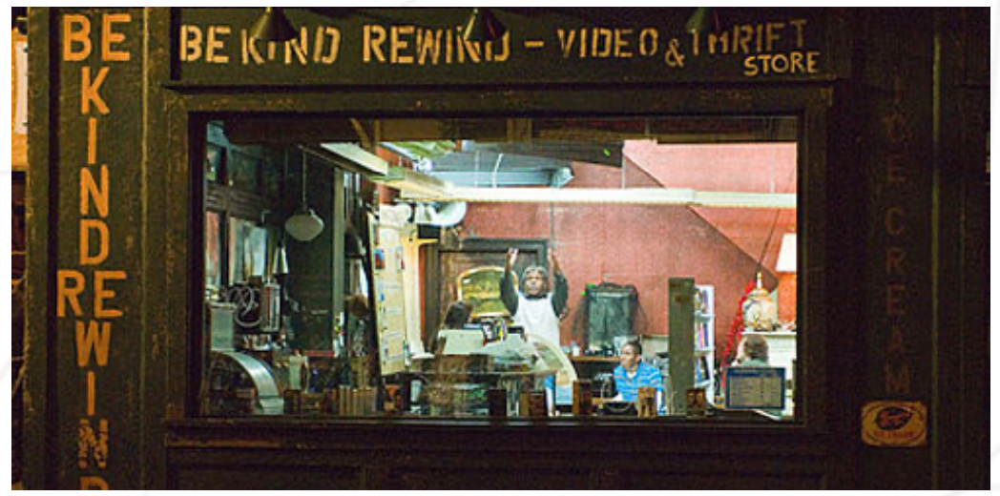
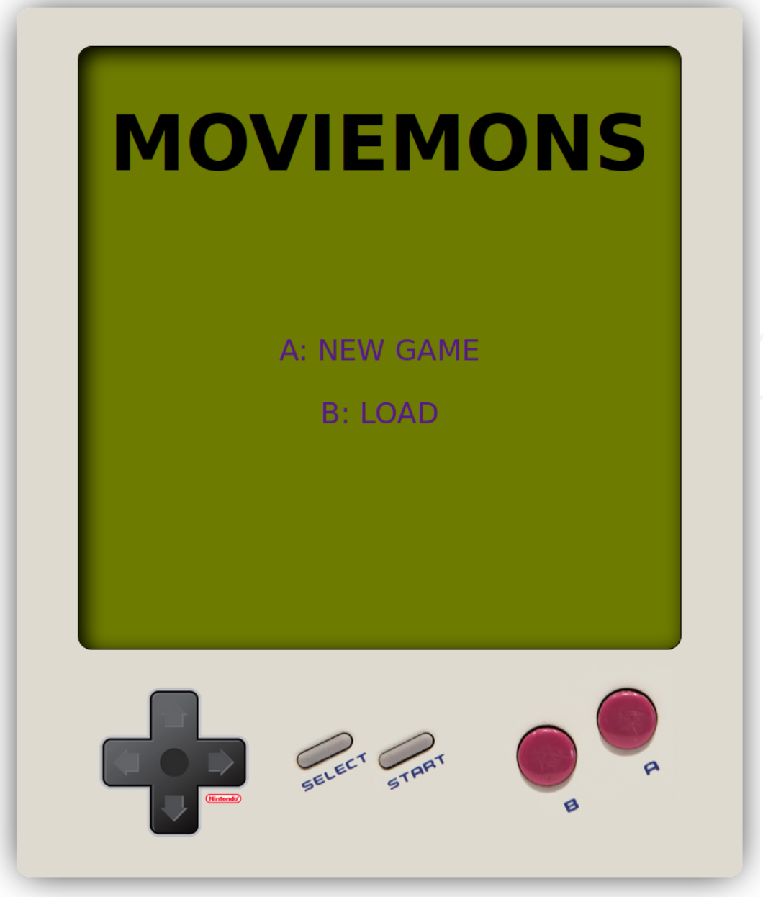
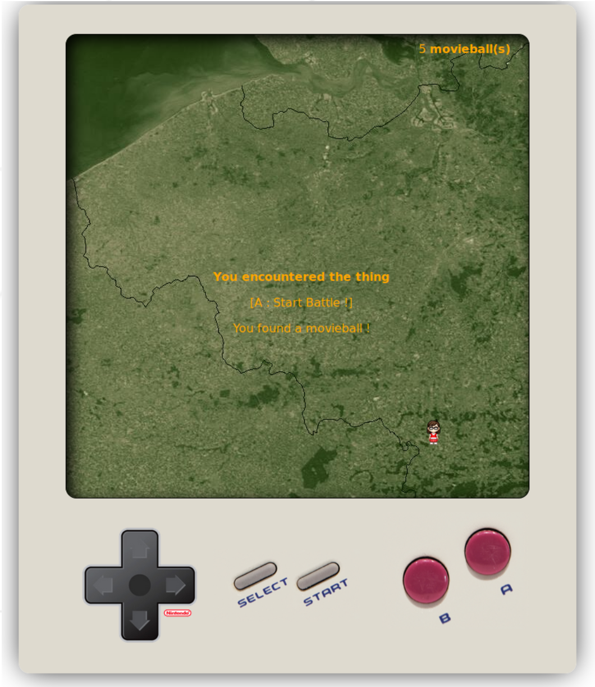

# **Rush00 - Piscine Python-Django**

## 파이썬-쟝고 연습 - 러쉬 00

### 무비몬

_요약: 파이썬 피씬 러쉬00 과제입니다._

##### _번역 오류 및 오역 제보는 42seoul_club_translate 채널 또는 @jiychoi 로 연락주세요._

<br>

# Contents

| Chapter | Contents                                      | page |
| :-----: | :-------------------------------------------- | :--: |
|    1    | [**Instructions**](#Chapter-1)                |  2   |
|    2    | [**Day-specific rules**](#Chapter-2)          |  3   |
|    3    | [**Preamble**](#Chapter-3)                    |  4   |
|    4    | [**Mandatory part**](#Chapter-4)              |  7   |
|   4.1   | [**Introduction-FAQ**](#Chapter-4.1)          |  7   |
|   4.2   | [**Instructions**](#Chapter-4.2)              |  8   |
|  4.2.1  | [**Settings**](#Chapter-4.2.1)                |  8   |
|  4.2.2  | [**Game Data**](#Chapter-4.2.2)               |  8   |
|  4.2.3  | [**Data Management**](#Chapter-4.2.3)         |  9   |
|  4.2.4  | [**Game's esthetics**](#Chapter-4.2.4)        |  9   |
|  4.2.5  | [**Pages**](#Chapter-4.2.5)                   |  10  |
|    5    | [**Bonus part**](#Chapter-5)                  |  16  |
|    6    | [**Turn-in and peer-evaluation**](#Chapter-6) |  17  |
|    7    | [**Turn-in example**](#Chapter-7)             |  18  |

<br>

# **Chapter 1**

## Instructions

<br>

노골적인 모순이 없는 이상, 해당 지침은 Python Django Piscine 모든 날짜에 적용됩니다.

- 이 페이지에 있는 내용만이 레퍼런스로 적용됩니다. 루머를 믿지 마세요!

- 조심하세요! 과제를 제출하기 한 시간 전까지도 해당 문서는 변경될 수 있습니다.

- 이번 과제들은 난이도별로 배치되어 있습니다 - 쉬운 것부터 어려운 것 까지요. 만약 쉬운 과제가 제대로 작동하지 않으면, `우리는 절 대` 어려운 과제를 (완벽하게 구현하였더라도) 채점하지 않을 것입니다.

- 파일과 디렉토리에 적절한 권한 설정을 해 주었는지 확인하세요.

- 각 과제별로 **제출 필수사항**을 지키셔야 합니다.

- 여러분의 과제는 같은 피씨너들에게 채점받고 점수가 매겨질 것입니다.

- 그리고 그 뒤에, 뮬리넷이라는 프로그램에 의해 채점되고 점수가 매겨질 것입니다. 뮬리넷은 여러분의 과제를 정말 엄격하고 꼼꼼하게 채점할 것입니다. 또한 모든 작업은 자동으로 진행되므로, 여러분이 뮬리넷과 협상하는 것은 불가능합니다. 좋지 못한 결과를 깜짝 선물로 받고 싶지 않다면, 철저히 과제에 임하세요.

- 쉘 과제들은 `/bin/sh`에 의해 실행될 수 있어야 합니다.

- 여러분은 **절대로** 명시된 제출 파일 외의 다른 파일들을 폴더 내에 남겨두시면 **안됩니다.**

- 질문 있으세요? 오른쪽 동료에게 물어보세요. 아니면 왼쪽 동료한테 물어보세요.

- 여러분이 참고할 만한 가이드는 `Google / man / 인터넷` 등이 있습니다.

- 인트라나 슬랙의 피씬 채널에서 토의하는 것을 잊지 마세요!

- 예시를 꼼꼼히 살펴보세요. 과제에 명시되지 않은 상세한 부분들이 들어있을 수도 있으니까요..

<br>

# **Chapter 2**

## Day-specific rules

<br>

- `python3` 인터프리터를 사용합니다.

- 어플리케이션과 관련된 모든 경로들은 프로젝트 폴더 내의 `urls.py`에 정의되어 있어야 합니다.

- 보여지는 모든 페이지들은 적절한 포맷으로 구성되어 있어야 합니다. (doctype, html 태그 사용, body와 head는 반드시 포함되어야 하는 등) 또한 깨진 문자열이 없도록, 특수문자가 적절히 관리되어 있어야 합니다.

- 러쉬를 위해서는 `manage.py`에서 제공되는 쟝고의 기본 개발용 서버를 사용할 것입니다.

- 과제에서 특별히 요구한 URL만 에러 없이 페이지를 제대로 리턴해야 합니다. 예를 들면, `/ex00`만을 요구할 때, `ex00foo` url은 404 에러를 표시해야 합니다.

- pip freeze를 통해 필요한 라이브러리를 모두 담은 requirement.txt 파일을 제출하여야 합니다.

<br>

# Chapter 3

## Preamble

<br>

다음은 영화 [Be Kind Rewind](http://www.imdb.com/title/tt0799934/) 에서 잭 블랙의 대사들입니다 :



사진 3.1 : 비디오 가게

---

제리: 나는 로보캅이다. 너의 모든 발언들은 로보캅 법정에 올라갈 수 있음을 명시해라.

---

제리: 난 널 쏠 수도 있다. 또 나는 로봇 카라테도 할 줄 안다고.

---

제리: 너네 삼촌이 심술궂다는 뜻이 아니다. 야간대학에 다니셔야 할 것 같긴 하다만.

---

제리: 나는 널 차세대 마릴린 먼로로 만들어 주려고 했지! 하지만 지금은 아냐! 넌 그냥 빨랫방 아낙네나 하라구!

---

제리: 야, 야, 신발을 냉장고에 넣으면 어떡해.. 감기걸리면 어떡하려고!

---

마이크: (고스트버스터즈 테잎을 들고) 내가 빌 머레이를 맡을래. 넌 딴거해.

---

제리: (불쌍한 목소리로, 고스트버스터즈 음정에 맞추며) 네가 그 길을 걸을 때...

제리: [노래중] ... 작은 유령을 만나겠지...

제리: [노래중] ... 우리는 무엇을 해야 할까 ...

제리: 고스트버스터즈?

마이크: 뭐? 그게 뭔데?

제리: 고스트버스터즈 테마곡이야.

마이크: 아닌데.

제리: 내가 좀 잘 부르긴 했지.

---

알마: 우리 사귀는거 맞지?

마이크: 뭐?

알마: 흐흥~

마이크: 야, 그걸 내가 어떻게 알아?

알마: 너도 알잖아. 상상 속 친구랑 하루에 20분 넘게 대화하면 그 사람이랑 사귀는 거나 마찬가지라구.

마이크: 내가 상상속 사내자식이랑 20분동안 대화하면 그건 뭔데?

알마: 너 제리랑 사귀는구나?

---

너는 이름짓고, 우리는 쏜다

---

가끔 우리가 만든 순간이 최고의 영화가 되기도 한다

---

[출처](http://www.quotes.net/movies/13167)

<br>

# Chapter 4

## Mandatory part

# Chapter 4.1

## Introduction - FAQ

<br>

이번 러쉬의 목표는 웹에서 구동되는 작은 1인용 게임을 만드는 것입니다.

- `게임의 목표가 뭔데요?`

  `무비몬` 이라는 게임을 만들 겁니다. 목표는 맵에 숨어있는 모든 무비몬을 무비볼을 이용해서 모조리 잡아버리는 겁니다.

- `어? 그거... 내가 아는 그거 아님..?`

  뭐요? 무슨 말인지 모르겠네요.

- `무비몬이 뭔데?`

  `무비몬`은 IMDb에서 찾을 수 있는 영화입니다. 되도록이면 괴수 영화가 좋겠네요.

- `무비몬은 어떻게 잡는데?`

  `무비볼`을 던지세요! `무비몬`의 강력함은 IMDb 평점에 따라 결정됩니다. 높은 평점일 수록 `무비몬`을 잡기는 어려워지지요. 플레이어의 강력함은 보유하고 있는 `무비몬`의 마릿수에 따라 결정되고, 플레이어가 강할 수록 무비몬을 잡기가 쉬워집니다.

- `게임 진행은 어떻게 됩니까?`

  플레이어가 새로운 게임을 실행했을 때, 게임은 IMDb상의 모든 필요한 필름들을 리퀘스트하여, 게임의 메인 페이지인 Worldmap에 보내야 합니다.

  플레이어는 페이지를 자유롭게 한 칸씩 이동할 수 있습니다. 돌아다니면서, `무비볼`을 획득하거나 `무비몬`과 조우할 수 있습니다.

  `무비몬`을 만났을 때, 잡을만 하다고 판단되면 플레이어는 포획을 시도할 수 있습니다.

  무비볼을 무비몬에게 던지고, 실패하면 또 던지고, 실패하면 또 던지고, 뭐 잡을 때까지 시도하는 거죠! 성공하면 플레이어는 다른 무비몬을 잡으러 가기 전, 그들의 `무비도감`에 자랑스러운 획득 이력을 기록할 수 있습니다. 전부 잡아 보세요! (무비몬 말이에요. 당연히..)

<br>

# Chapter 4.2

## Instructions

# Chapter 4.2.1

## Settings

<br>

다음과 같은 게임 설정을 구현해야 합니다 :

- 모눈 (그리드) 크기. 정사각형 10\*10개가 최소 크기입니다.

- 그리드상에서의 플레이어의 시작 위치

- IMDb에 요청할 최소 10종류의 영화 이름 또는 ID. 말했다시피, 괴수 영화일 수록 좋습니다.

이 설정들을 코드에 구현하여야 합니다.

원하신다면 다른 설정을 추가하셔도 되지만, 당연히 적절한 이유가 있어야 하고, 제대로 작동되어야 합니다!

> ℹ️ <br>
> 영화의 평점이 무비몬의 힘을 좌우합니다. 무비몬들 사이의 힘 밸런스를 조절하여 충분히 강한 몬스터와 약한 몬스터들이 공존하도록 하세요. 최소 3개의 '4점보다 낮은 평점 영화'와 최소 3개의 '7점보다 높은 평점의 영화'를 사용하는 것을 추천합니다.

> 💡 <br>
> IMDB API가 상당히 모호합니다. 비공식 API인 OMDB (http://www.omdbapi.com/) 를 사용하셔도 됩니다.

<br>

# Chapter 4.2.2

## Game Data

게임 진행 중에, 한 페이지로부터 다음 페이지로 데이터를 저장하여야 합니다. 보통의 웹사이트라면 쿠키나 서버상 세션 시스템을 사용하겠지만, 이건 그 정도의 웹 사이트가 아니니까요.

게임의 현재 상태를 담은 데이터를 프로젝트 내에 생성된 파일에 저장해 놓아야 합니다.

이 파일은 플레이어를 위한 게 아닙니다. 진행중인 게임 상황을 저장하기 위한 것입니다. 어떠한 로직 같은 것도 파일에 포함되면 안 되고, `pickle` 라이브러리 (`Python`에 있습니다) 를 사용하여 이진 데이터로 저장되어야 합니다.

또한 프로젝트에서, 이 파일을 사용하고 업데이트하는 로직을 구현해야 합니다. 파일에는 다음과 같은 정보가 포함됩니다 :

- 맵에서 플레이어의 위치

- 소지한 `무비볼` 개수

- `무비도감` 에 저장된 `무비몬`들 이름 (또는 ID)

- `IMDb`에서 수집한, 게임 내에 존재하는 모든 `무비몬` 데이터

<br>

# Chapter 4.2.3

## Data management

게임 데이터를 관리하기 위한 `Python` 클래스를 구현하여야 합니다. 이 클래스는 다음과 같은 메소드를 포함합니다 :

- 'load' : 클래스 인스턴스의 패러미터로 받아온 게임 데이터를 불러옵니다. 현재 인스턴스를 반환합니다

- 'dump' : 게임 데이터를 반환합니다.

- 'get_random_movie' : `무비몬`들 중 아직 포획하지 않은 랜덤한 무비몬을 반환합니다.

- 'load_default_settings' : settings으로부터 클래스 인스턴스에 있는 게임 데이터를 불러옵니다. `IMDb`로부터 `무비몬` 데이터를 리퀘스트하여 불러옵니다. 현재 인스턴스를 반환합니다.

- 'get_strength' : 현재 플레이어의 강함을 리턴합니다.

- 'get_movie' : 패러미터로 받은 `무비몬`의 이름과 `Detail` 페이지에서 필요로 하는 모든 상세 데이터를 `Python` 딕셔너리에 저장하여 반환합니다.

게임을 구현하면서 필요할 것 같은 메소드들과 어트리뷰트들을 자유롭게 추가하여도 됩니다.

> ℹ️ <br>
> 평가 시에는, 이 데이터 파일 또는 앞으로의 세이브 파일들을 직접 손으로 수정하거나 지워버리라는 요구는 절대 없을 예정이니 안심하세요.

<br>

# Chapter 4.2.4

## Game's esthetics

게임은 `HTML`과 `CSS`로만 브라우저에 표현되어야 합니다. `Javascript` 금지!

게임 디스플레이는 크게 두 파트로 나뉘어지며, 플레이어는 이 두 요소를 명확하게 구분해야 합니다 :

- `게임 화면` : 게임에서 무슨 일이 일어나고 있는지 표시합니다. 플레이어가 직접적으로 상호작용할 수 없습니다. 링크나 폼을 포함하면 안 됩니다.

- `조작부` : 게임 화면의 하단에 위치하거나 양 쪽에 위치할 수 있습니다. 플레이어가 직접적으로 조작하여 상황에 맞게 게임과 상호작용 하는 부분입니다. 달리 말하자면, 현재 게임 상황에 맞춰서, 조작 시 취해지는 행동이 달라져야 한다는 뜻입니다. 또한 항상 활성화되어 있을 필요도 없다는 것을 의미합니다. 다만 활성화되지 않은 상황에서도, 페이지의 `제대로 된 위치에 잘 보여야` 합니다.

8개의 버튼이 존재해야 합니다:

- 게임패드에서 찾을 수 있는 상하좌우 버튼 4개

- `Select` 버튼

- `Start` 버튼

- `A` 버튼

- `B` 버튼

다른 버튼을 추가하는 건 금지됩니다. 버튼의 이름 외의 다른 정보를 여백에 보여주는 것도 마찬가지로 금지입니다.

이상의 요구사항을 제외하면, 여러분의 미적 감각은 필수 파트의 채점에 영향을 끼치지 않을 것입니다. 물론 예쁘게 만들면 보너스 포인트를 조금 받을 수는 있겠지요.

각 시점에서의 버튼 동작은 뒤에 설명할 것입니다.

> ℹ️ <br>
> '버튼' 이 굳이 HTML \<button> 태그일 필요는 없습니다. 비활성화된 버튼은 죽은 link (dead link), 이미지, 텍스트, 특수문자 등으로 표현될 수 있습니다.

<br>

# Chapter 4.2.5

## Pages

다음과 같은 페이지/시점/행동을 구현해야 합니다. 여기서 언급되지 않는 버튼은 해당 지점에서 비활성화되어야 함을 의미합니다. 또한 조작을 통해 접근할 수 있는 목적지가 언급되지 않은 경우, (상태가 바뀌었을 가능성이 높은) 같은 페이지에 머물러 있어야 함을 뜻합니다.

<br>

### `TitleScreen`

- 설명: 타이틀 화면.

- 화면: 은 게임 타이틀과, 'A - New Game', 'B - Load' 를 표시해야 합니다.

- URL: 간단한 겁니다. 도메인명과 포트.

- 조작:

  - `A` : `Worldmap` 페이지로 가는 링크.

  월드맵이 표시되기 전에, 현재 게임 정보를 담은 파일은 `Settings` 패러미터와 함께 다시 초기화되어야 하고, `무비몬` 데이터는 다시 리퀘스트되어야 합니다.

  - `B` : `Load` 페이지로 향하는 링크.

<br>

### `Worldmap`

- 설명: 주인공이 실질적으로 움직이고, `무비볼`을 얻고, `무비몬`을 잡는 부분.

- 화면: Settings에서 정의한 그리드 크기 설정이 적용되어야 합니다. 플레이어 표시 (이미지나 문자 등등...) 가 현재 진행 지점에 제대로 서 있도록 올바르게 보여져야 합니다.

화면은 다음 정보들 또한 보여주어야 합니다:

- `무비볼` 개수

- `무비볼`을 획득했을 때 메시지

- `무비몬` 이 튀어나왔을 때의 메시지와, 무비몬을 잡는 동작으로 넘어갈 수 있는 버튼의 표시

- URL: `'/worldmap'`

- 조작:

  - `방향키`: 캐릭터를 해당 방향으로 한 칸씩 움직여야 합니다. 다만 캐릭터가 맵을 뚫고 나가면 안 됩니다.

  한 칸씩 움직일 때마다 `무비몬`을 조우할 기회나 `무비볼`을 얻을 기회가 랜덤하게 주어집니다.

  `무비몬`이 튀어나오면, 종류는 아직 포획하지 않은 `무비몬` 중 랜덤하게 결정됩니다.

  - `A`: 무비몬이 튀어나왔을 때만 활성화됩니다. `Battle` 페이지로 이동하여 `무비몬`과 싸우게 됩니다.

  - `start`: `옵션 (Options)` 페이지로 이동합니다.

  - `select`: `무비도감 (Moviedex)` 페이지로 이동합니다.

> ⚠ <br>
> 이 페이지를 새로고침했을 때 플레이어 위치가 변경되면 안 됩니다!

<br>

### `Battle`

- 설명: 튀어나온 무비몬을 잡으세요!

- URL: `/battle/<moviemon_id>`. <moviemon_id\> 부분은 조우한 `무비몬`의 ID가 되어야 합니다.

- 화면: 조우한 `무비몬` 의 포스터와 강력함을 표시하여야 합니다. 또한 `무비볼` 개수나, 플레이어의 강력함과 승률도요.

  만약 무비몬을 잡았다면, 획득 대사 (말장난을 의도한 건 아니에요) (_주: '획득 대사' 와 영화 홍보 시 사용되는 '캐치프레이즈' 가 둘다 Catch phrase인 것에 대한 말장난으로 추정됩니다_) 를 표시해야 합니다. "붙잡았다!" 같이, 이벤트를 기념할 만한 걸루요.

  실패했다면, "아쉽게 놓쳤다!" 같은 대사를 출력해야 합니다.

  `무비몬`이 잡히지 않았을 때에 한해서, 화면에는 'A - Launch Movieball' 이라는 문구를 출력해야 합니다.

  아무튼, '버튼' B는 플레이어가 `Worldmap` 으로 돌아갈 수 있다는 것 또한 화면에 항상 보여주어야 합니다.

- 조작:

  - `A` : `무비볼` 던지기.

  소지한 무비볼이 없다면, 해당 기능은 무효가 됩니다. (적 무비몬이 플레이어를 조롱하는 모습 같은 걸 화면에 담아도 됩니다)

  그 외에는, 무비볼의 개수가 1 줄어들고, 행운 수치를 이용해 `무비몬` 이 포획되었는지 여부를 랜덤하게 판정합니다.

  행운 수치는 다음과 같이 결정됩니다:

  C = 50 - (몬스터의 강력함 _ 10) + (플레이어의 강력함 _ 5)

  그리고 C는 1 <= C <= 90

```
  > 예시 : 8.2짜리 몬스터와 2짜리 플레이어:
  > C = 50 - 82 + 10 = -22
  > 해당 몬스터는 1% 포획률을 가집니다.
```

```
  > 예시 : 5짜리 몬스터와 8짜리 플레이어:
  > C = 50 - 50 + 40 = 40
  > 해당 몬스터는 40% 포획률을 가집니다.
```

```
  > 예시 : 2짜리 몬스터와 14짜리 플레이어:
  > C = 50 - 20 + 70 = 100
  > 해당 몬스터는 90% 포획률을 가집니다.
```

포획에 성공했다면, `무비몬`이 붙잡히고 `무비도감` 에 등록됩니다. A 버튼은 비활성화 됩니다.

실패를 대비하여, 플레이어는 소지한 무비볼이 바닥날 때까지 무비볼을 계속 던질 수 있습니다.

- `B` : `월드맵 (Worldmap)` 으로 돌아가기

<br>

### `Moviedex`

- 설명: 포획한 모든 `무비몬` 리스트. 각 영화를 선택하고 정보를 열람할 수 있어야 합니다.

- URL: `/moviedex`

- 화면: 포획한 `무비몬` 의 포스터가 보여야 합니다. 선택한 포스터는 파란 테두리가 쳐지는 등의 효과를 부여하여 두드러지게 표현되어야 합니다.

  'A - More Information', 'select - Back' 등의 문구도 표시해야 합니다.

- 조작:

  - `방향키`: 영화를 선택하는 데에 이동합니다. 최소 좌/우 또는 상/하 2개 방향키가 사용되어야 합니다.

  - `select`: `월드맵 (Worldmap)` 페이지로 돌아가기

  - `A`: 선택한 `무비몬`의 상세 페이지로 이동

> ℹ️ <br>
> 해당 페이지에 도달했을 때 기본적으로 선택되어 있는 영화는 리스트의 첫 번째 영화가 되어야 합니다.

<br>

### `detail`

- 설명: 무비몬의 상세설명

- URL: `’/moviedex/<moviemon>`, <moviemon\> 에는 선택한 `무비몬`의 ID가 되어야 합니다.

- 화면: `무비몬`의 영화 제목, 포스터, 감독, 개봉 연도, 평점, 시놉시스와 배우 등이 'B - Back' 안내 문구와 함께 표시되어야 합니다.

- 조작:

  - `B` : `무비도감 (Moviedex)` 페이지로 이동

<br>

### `Option`

- 설명: 게임 옵션 설정

- URL: `’/options`

- 화면: 게임 옵션을 표시해야 합니다: 'A - Save', 'B - Quit', 'Start - Cancel' 문구를 의미합니다.

- 조작:

  - `start` : `월드맵 (Worldmap)` 페이지로 이동

  - `A` : `저장 (Save)` 페이지로 이동

  - `B` : `타이틀 화면 (TitleScreen)` 페이지로 이동

<br>

### `Save`

- 설명: 현재 진행 상황을 세 개의 슬롯 중 하나에 저장할 수 있도록 합니다.

- URL: `’/options/save_game`

- 화면: 세 개의 슬롯을 표시해야 합니다 : 'Slot A', 'Slot B', 'Slot C'

  선택된 슬롯은 이름에 화살표가 표시되는 등 두드러지는 그래픽 요소로 표시되어야 합니다.

  슬롯이 비어있을 경우, 'Free' 라는 문구가 적혀 있어야 합니다. 그 외의 경우에는, 포획한 `무비몬` 마리수가 표시되어야 합니다.

  예를 들어, 'Slot A : 2/15' 는 15마리 무비몬 중 2마리를 잡은 세이브파일을 의미합니다.

  화면에는 'A - Save' 와 'B - Cancel' 문구가 같이 표시되어야 합니다.

- 조작:

  - `방향키` : 상/하 키로 슬롯을 선택할 수 있습니다.

  - `A` : 현재 상황을 담은 파일을 프로젝트의 'saved_game' 폴더에 복사하여 저장해야 합니다.

  파일명은 'slot<n\>\_<score\>.mmg' 형식을 따라야 합니다. <n\> 에는 슬롯의 종류 (A, B, C) 가 들어가야 하고, <score\> 은 게임 점수가 저장되어야 합니다.

  예를 들면: slotb_1_15.mmg 이런 식으로요. (슬래시 기호 (/) 를 파일명에 넣을 생각은 하지 말아줘요.)

  - `B` : `옵션 (Option)` 페이지로 이동

<br>

### `Load`

- 설명: 3개의 슬롯 중 하나에서 게임을 불러올 수 있도록 합니다.

- URL: `’/options/load_game`

- 화면: 세 개의 슬롯 ('Slot A', 'Slot B', 'Slot C') 을 표시해야 합니다.

  선택된 슬롯은 이름에 화살표가 표시되는 등 두드러지는 그래픽 요소로 표시되어야 합니다.

  슬롯이 비어있을 경우, 'Free' 라는 문구가 적혀 있어야 합니다. 그 외의 경우에는, 포획한 `무비몬` 마리수가 표시되어야 합니다.

  예를 들어, 'Slot A : 2/15' 는 15마리 무비몬 중 2마리를 잡은 세이브파일을 의미합니다.

  화면에는 'A - Load' 와 'B - Cancel' 문구가 같이 표시되어야 합니다. (_역주: 원문에는 'A - Save' 로 되어 있습니다. Load 페이지와 맞지 않는 오타로 추정됩니다._)

  게임이 불러와진 후, 'A - Load' 문구는 'A - Start game' 으로 바뀌어야 합니다.

- 조작:

  - `방향키` : 상/하 키로 슬롯을 선택할 수 있습니다.

  - `A` :

  아직 게임이 불러와지지 않았을 때: 선택한 슬롯에 해당하는 파일을 복사해서 내용을 현재 상황으로 불러와야 합니다.

  게임이 불러와졌다면, `월드맵 (Worldmap)` 페이지로 이동하는 용도로 사용됩니다.

  당연하지만, Free 슬롯을 선택했을 땐 아무런 동작도 하면 안 됩니다.

  - `B` : `타이틀 화면 (TitleScreen)` 페이지로 이동

# Chapter 5

## Bonus part

<br>

필수 구현 파트가 완벽하게 완성되었을 때, 추가적인 기능을 구현하여 보너스 점수를 얻을 수 있습니다.

평가자가 추가 기능들을 보고 납득할 수 있도록, 기능이 필요한 이유와 유용성 등을 제대로 설명할 수 있어야 합니다.

에러나 결점이 발생하면 당연히 해당 기능을 무효로 취급합니다.

이 보너스 파트에선 (필수 파트에 영향을 끼치지 않는다는 선에서) Javascript가 용납됩니다. 이 말은 필수 파트는 Javascript를 제외하고서라도 구동되어야 한다는 의미입니다. AJAX나 Websockets 사용은 금지입니다.

보너스를 위한 아이디어를 몇 개 드리겠습니다:

- 게임 콘솔처럼 웹사이트를 디자인해 보세요.

  - 게임 화면이 진짜 게임 화면처럼 보이면 좋겠죠?

  - 이미지 매핑을 이용해서 컨트롤키를 진짜 게임기 컨트롤러처럼 꾸며도 재밌을 것 같네요.

- 필수 구현 파트만으로는, 무비몬의 이미지를 보면 포획률을 계산하기가 지나치게 쉽지요? 토큰 시스템을 구현해서 몇몇 `무비몬`을 알아보기 힘들게 만들거나, 맞추기 어렵게 꼬아 보세요. 토큰은 URL에 사용하여 무비몬을 검색하는 등의 부정행위를 막는 데에 사용됩니다.

- 컨트롤 키를 키보드 키와 1대1 대응시켜 마우스를 사용하지 않아도 되도록 해 보세요.

- 게임의 다양성을 구현하기 위해, 새로운 게임을 시작할 때마다 서로 다른 몬스터 묶음을 불러오도록 해 보세요.

- `월드맵`을 역동적으로 구현하기 위해, 플레이어의 위치와 인접한 셀에서 `무비몬/무비볼`을 감지할 수 있는 레이더를 추가해보는 건 어떨까요? 더 양념을 쳐 보자면, 레이더를 아이템화하여 획득 후 한 번만 사용할 수 있도록 구현하는 것도 재밌겠지요!

<br>

# Chapter 6

## Turn-in and peer-evaluation

완벽하게 구성된 `Django` 프로젝트를 제출하세요.

필수 구현 파트를 제외하면, 나머지는 마음껏 구성하셔도 좋습니다.

서버 에러는 용납되지 않습니다. 여러 상황을 철저하게 체크해 보세요.

프로젝트를 동작시키기 위한 라이브러리들을 설치하기 위해 requirement.txt 제출은 필수입니다.

> 💡 <br>
> 쟝고는 URL을 찾을 수 없을 경우 자동으로 404 에러를 반환합니다. 가끔 여러분의 로직에 오류가 있을 때, 쟝고가 해당 경우와 일치하는 URL을 찾는 것을 볼 수 있습니다. 이런 경우엔, 여러분의 view에 "raise Http404('my message') 를 사용해 보세요.

<br>

# Chapter 7

## Turn-in example

<br>



이미지 7.1 : 타이틀 화면은 다음과 같이 구성될 수 있습니다.

<br>



이미지 7.2 : 벨기에에서 무비몬 게임이 시작되었습니다.
