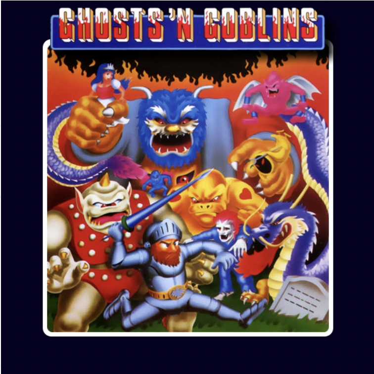
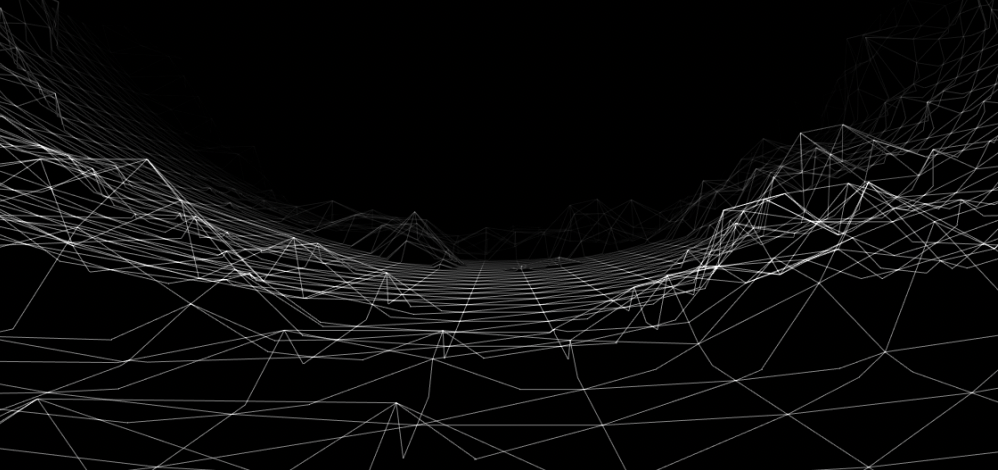
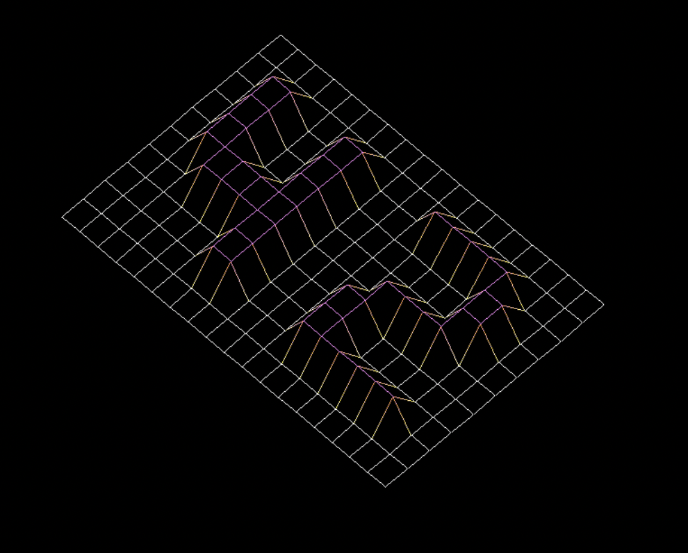

# FDF

##### _Summary: This project is about creating a simplified 3D graphic representation of a relief landscape._

_요약: 이 프로젝트에서는 굴곡진 지형을 간단한 3D 그래픽으로 묘사해 볼 것입니다._

##### _Version: 2_

_버전 2_

<br>

# Contents

| Chapter |                     Contents                     | page |
| :-----: | :----------------------------------------------: | :--: |
|    I    |            [**Foreword**](#Chapter-1)            |  2   |
|   II    |          [\*_Introduction_](#Chapter-2)          |  5   |
|   III   |           [**Objectives**](#Chapter-3)           |  6   |
|   IV    |      [**Common Instructions**](#Chapter-4)       |  7   |
|    V    |         [**Mandatory part**](#Chapter-5)         |  9   |
|   VI    |           [**Bonus part**](#Chapter-6)           |  11  |
|   VII   | [**Submission and peer correction**](#Chapter-7) |  12  |

<br>

# Chapter 1

## Foreword

##### _This is what Wikipedia has to say about `Ghosts’n Goblins`:_

다음은 위키피디아에서 발췌해온 "마계촌 (Ghosts'n Goblins)" 에 대한 설명입니다:

##### _`Ghosts’n Goblins` is a platform game where the player controls a knight, named Sir Arthur, who must defeat zombies, ogres, demons, cyclops, dragons and other monsters in order to rescue Princess Prin Prin, who has been kidnapped by Satan, king of Demon World. Along the way the player can pick up new weapons, bonuses and extra suits of armor that can help in this task.._

"`마계촌`"은 '아서'라 불리우는 캐릭터를 조종하여 좀비, 오우거, 악마, 키클롭스, 드래곤들과 기타 몬스터들을 무찌르고 마계의 왕 사탄에게 납치당한 프린프린 공주를 구하는 플랫포머 게임입니다. 게임을 진행하며 플레이어는 새로운 무기나 보너스 아이템, 추가 방어구를 얻음으로써 퀘스트를 수월히 진행해나갈 수 있습니다.

##### _The game is often considered very difficult by arcade standards and is commonly regarded as one of the most difficult games ever released. The player can only be hit twice before losing a life (the first hit takes away Arthur’s armor, and the player must continue on in his underwear until completing the level or finding replacement armor). If the player loses a life, he is returned to the start of the level, or the halfway point if he has managed to get that far. Furthermore, each life can only last a certain length of time (generally around three minutes), the clock being reset at the start of a level. If the clock does run out, the player instantly loses that life._

이 게임은 아케이드 게임 기준으로 어려운 편에 속하며, 지금까지 출시된 게임들 중에서도 가장 어려운 게임들 중 하나로 회자됩니다. 플레이어 캐릭터는 두 대만 맞아도 사망하며 (첫 공격은 아서의 갑옷을 날려버리며, 두 번째 공격을 맞기 전에 플레이어는 속옷바람으로 해당 레벨을 클리어하거나 새로운 갑옷을 찾아야 합니다) 사망할 경우 플레이어는 해당 레벨의 맨 처음으로 되돌아가거나, 중간 지점을 찍었을 경우 중간 지점으로 돌아갑니다. 설상가상으로 제한 시간이 정해져 있으며 (약 3분) 이는 각 레벨에 진입했을 때 초기화됩니다. 제한시간이 경과하면 플레이어는 바로 사망합니다.

##### _After defeating the final boss, but only with the cross weapon (if the player does not have the cross weapon, they will be prompted that it is needed to defeat the boss and restart at the beginning of level 5 and must repeat round 5 and 6 again regardless if the weapon is obtained immediately or not) for the first time the player is informed that the battle was a trap devised by Satan. The player must then replay the entire game on a higher difficulty level to reach the genuine final battle._

십자가 무기만을 가지고 (십자가 무기를 가지고 있지 않으면 보스 격파에 필요하다는 메시지가 출력된 뒤 5레벨 처음부터 다시 시작해야 하며, 무기를 즉시 획득했더라도 5레벨과 6레벨을 다시 클리어하여야 합니다) 마지막 보스를 격파할 경우, 이번 결투는 사탄이 만들어낸 함정이라는 메시지가 출력되며, 플레이어는 난이도가 상승한 모든 레벨을 처음부터 다시 클리어하여 진정한 최후의 보스전에 진입하여야 합니다.

- ##### Ports

  이식판

  ##### _Many conversions to home computers were produced by Elite Systems._

  대부분의 가정용 컴퓨터 이식판은 Elite Systems에서 발매하였습니다.

- ##### _The Commodore 64 version, released in 1986, is known for its music by Mark Cooksey, which borrows from Frédéric Chopin’s Prelude No. 20. Due to the limited resources on the Commodore 64, it was somewhat different from the arcade version. It only features the Graveyard and Forest, The Ice Palace, The Floating Platforms and Firebridge and The Caves in that order. The player also starts the game with five lives. The demon that kidnapped the princess replaces Astaroth in the title screen. Additionally, the cyclops (or “Unicorn”) is the boss of levels one to three and the dragon is the final boss._

  코모도어 64 버전은 1986년에 발매되었으며, 프레데리크 쇼팽의 프렐류드 20번을 차용한 Mark Cooksey의 노래로 유명합니다. 코모도어 64의 한정적인 성능 때문에, 아케이드 버전과는 차이가 있습니다. 맵은 묘지, 숲, 얼음성, 유령섬, 화염다리와 동굴만이 이 순서대로 등장하며, 플레이어는 5개의 생명을 가지고 시작합니다. 타이틀 화면에서 아스타로트는 공주를 납치한 악마로 대체되며, 키클롭스 (일각수) 는 1 ~ 3레벨의 보스로, 드래곤이 마지막 보스로 등장합니다.

- ##### _The version for Commodore 16/116 and Commodore Plus/4, also released in 1986 by Elite Systems, was even more limited than the C64 version. It was written to work on a Commodore 16, which had only 16 KB of RAM. Therefore, this version features only two levels and no music. In addition, the remaining two levels and the gameplay are simplified. For example, in the graveyard level, the attacking bird, the “plant monsters” and the winged demon are all missing from the C16 version, and there is only one weapon. The title screen features no graphics besides the stylised Ghosts ’n Goblins lettering._

  코모도어 16 / 116, 코모도어 플러스 / 4 버전 또한 1986년에 Elite Systems에 의해 발매되었습니다만, 16kb 램으로 동작하는 코모도어 16에 맞추어 개발되었기 때문에 코모도어 64 버전보다 더욱 열악한 성능으로 출시되었습니다. 이 버전은 딱 두 개의 레벨만 존재하며, 배경음악은 흘러나오지 않습니다. 이에 더불어, 게임플레이 또한 단순화되었습니다. 예를 들어, 원래대로라면 묘지 맵에는 새와 "식물 몬스터", 날개달린 악마가 등장하여야 하지만, C16 버전에서 이들은 모두 생략되었으며 무기도 단 한 종류만이 등장합니다. 타이틀 화면에는 Ghosts 'n Goblins 제목을 제외한 어떠한 그래픽 요소도 출력되지 않습니다.

- ##### _A version for the Commodore Amiga was released in 1990. While the advanced hardware of the Amiga allowed an almost perfect conversion of the arcade game, it failed to emulate the success of the Commodore 64 version. The player starts the game with six lives and no music is played unless the Amiga was equipped with at least 1 Megabyte of RAM. The standard configuration of an Amiga 500 was 512 Kilobytes._

  코모도어 아미가 버전은 1990년에 출시되었습니다. 아미가의 발전한 하드웨어 성능 덕에 아케이드판의 거의 완벽한 이식이 가능했지만, 코모도어 64 버전의 대성공은 재현해내지 못했습니다. 플레이어는 6개의 생명을 가지고 시작하며, 아미가에 최소 1메가의 램이 장착되지 않은 이상 배경음악은 출력되지 않습니다. 아미가 500의 기본 구성은 512 Kb였기 때문이죠.

- ##### _The NES version was developed by Micronics. This also serves as the basis for the Game Boy Color version, which uses passwords to allow the player to jump to certain levels. The NES version was ported to the Game Boy Advance as part of Classic NES series, but only in Japan._

  NES 버전은 Micronics에 의해 이식되었으며, 스테이지를 뛰어넘을 수 있는 패스워드 기능을 넣음으로써 게임보이 컬러 버전의 초석을 닦았습니다. NES 버전은 클래식 NES 시리즈의 일부로 게임보이 어드밴스에도 이식되었지만, 일본에서만 발매되었습니다.

- ##### _The NES version was also re-released for download for Nintendo’s Virtual Console in North America on December 10, 2007 (Wii) and October 25, 2012 (Nintendo 3DS) and in the PAL region on October 31, 2008 (Wii) and January 3, 2013 (Nintendo 3DS) while the Wii U version was released in both regions on May 30, 2013. The arcade version was released on the Wii’s Virtual Console Arcade in Japan on November 16, 2010, the PAL region on January 7, 2011 and in North America on January 10, 2011._

  또한 NES 버전은 닌텐도의 버추얼 콘솔 다운로드판으로 이식되었으며, 북미에서는 2007년 12월 10일에 Wii 버전이 2012년 10월 25일에 닌텐도 3DS 버전이 재발매되었습니다. PAL 지역에서는 2008년 10월 31에 Wii 버전이, 2013년 1월 3일에 3DS 버전이 발매되었으며, 두 지역 모두 2013년 1월 3일에 Wii U 버전이 발매되었습니다. Wii 버추얼 콘솔 아케이드에서 구동가능한 아케이드 버전은 2010년 11월 16일에 일본에서, 2011년 1월 7일에 PAL 지역에서, 2011년 1월 10일에 북미에서 발매되었습니다.

- ##### _Ghosts’n Goblins was also ported to the ZX Spectrum, Amstrad CPC, MSX, Atari ST, IBM PC compatibles, Game Boy Color, Game Boy Advance. The original arcade version of the game was also included in the compilation Capcom Generations Vol.2: Chronicles of Arthur for the PlayStation (in Japan and Europe) and Sega Saturn (in Japan only), which also contained Ghouls’n Ghosts and Super Ghouls’n Ghosts. The three games (based on their Capcom Generation versions) were later collected as part of Capcom Classics Collection. The game was also featured in the compilation Capcom Arcade Cabinet for the PlayStation 3 and Xbox 360._

  마계촌은 ZX Spectrum, Amstrad CPC, MSX, 아타리 ST, IBM PC 호환버전, 게임보이 컬러, 게임보이 어드밴스로도 이식된 경력이 있습니다. 플레이스테이션 1 (일본판과 유럽판), 세가 새턴 (일본판) 에서 구동 가능한 오리지널 아케이드 버전은 캡콤 제너레이션 버전 2 "마계의 기사" 에 대마계촌, 초마계촌과 함께 수록되어 있습니다. 이 세 개의 게임은 캡콤 제너레이션 버전을 토대로 캡콤 클래식 컬렉션에도 수록되었으며, 훗날 플레이스테이션 3과 Xbox 360에서 구동 가능한 캡콤 아케이드 캐비닛에도 수록되게 됩니다.

- ##### _Reception_

  수상

  ##### _Computer Gaming World called Ghosts’n Goblins "an excellent example of what the [NES] can do ... while hardly groundbreaking, represents the kind of game that made Nintendo famous". Ghosts ’n Goblins was runner-up in the category of Arcade-Style Game of the Year at the Golden Joystick Awards. The NES version of Ghosts ’n Goblins was rated the 129th best game made on a Nintendo System in Nintendo Power’s Top 200 Games list. It was also a best seller for the NES, selling 1.64 million units. Ghosts ’n Goblins is often cited as an example of one of the most difficult games of all time to beat, due to its extreme level of difficulty and the fact the player must play through the game twice in order to beat the game._

  Gomputer Gaming World에서는 마계촌을 "NES가 무엇을 할 수 있는지 보여주는 아주 훌륭한 예시이며, 혁신적이진 않지만 닌텐도를 유명하게 만들어 준 게임 중 하나" 라고 평했습니다. 마계촌은 골든 조이스틱 어워드의 "올해의 아케이드 스타일 게임" 부문에서 2등을 차지하였으며, 마계촌의 NES 버전은 Nintendo Power에 의해 닌텐도 게임 top 200 중 129위를 차지하기도 하였습니다. 또한 NES 버전은 164만 카피를 판매한 NES 베스트셀러 게임이었으며, 극악의 난이도와 2회차의 존재 여부 덕에 가장 어려운 게임 중 하나로 종종 회자됩니다.

- ##### _Legacy_

  레거시

  ##### _Ghosts’n Goblins was followed by a series of sequels and spin-offs eventually becoming Capcom’s 8th best-selling game franchise, selling over 4.4 million units. Its sequels include Ghouls’n Ghosts, Super Ghouls’n Ghosts, and Ultimate Ghosts’n Goblins in addition to producing the Gargoyle’s Quest and Maximo spin-off series. Though originating as an arcade title, the franchise has been featured on a variety of PC and video game consoles with the latest entries in the series, Ghosts ’n Goblins: Gold Knights, released on the iOS. Additionally, the franchise frequently makes cameo appearances—the character of Arthur in particular—in other Capcom titles, the latest of which being Ultimate Marvel vs. Capcom 3._

  마계촌은 여러 시퀄과 스핀오프가 발매되며 캡콤의 8번째로 잘 나가는 게임 프랜차이즈가 되었습니다. 대마계촌, 초마계촌, 극마계촌이 시퀄로 분류되며, 외전으로 레드 아리마와 맥시모 시리즈가 출시되었습니다. 비록 시작은 아케이드판이었지만, 지금은 프랜차이즈가 확장하여 PC판 및 여러 게임 콘솔판으로 발매되었으며, 가장 최신에 출시된 마계촌 기사열전은 iOS에서 발매되었습니다. 이에 더불어 프랜차이즈에서는 다른 캡콤 타이틀에 아서를 카메오로 적극 출연시키고 있으며, 예시로 가장 최신에 나온 얼티밋 마블 vs 캡콤 3에서 아서가 캡콤 진영으로 등장합니다.

<br>



##### _Figure I.1: Game’s cover_

사진 1.1 : 게임 커버

<br>

# Chapter 2

## Introduction

##### _The representation in 3D of a landscape is a critical aspect of modern mapping. For example, in these times of spatial exploration, to have a 3D representation of Mars is a prerequisite condition to its conquest. As another example, comparing various 3D representations of an area of high tectonic activity will allow you to better understand these phenomena and their evolution, and as a result, be better prepared._

현대 매핑 기법에서 지형의 3D 표현은 아주 중요한 측면 중 하나입니다. 예를 들어, 화성의 3D 표현은 화성 정복의 전제조건 중 하나입니다. 또한, 지각활동이 많은 지역의 3D 표현을 비교하면 이러한 현상과 진화 과정을 쉽게 이해할 수 있으며, 이에 대한 대비 또한 수월해집니다.

<br>



<br>

# Chapter 3

## Objectives

##### _In this project, you will discover the basics of graphic programming, and in particular how to place points in space, how to join them with segments, and most importantly how to observe the scene from a particular viewpoint._

이번 과제에서는 그래픽 프로그래밍 기초를 배울 수 있습니다. 구체적으로는, 공간에 점을 배치하는 방법, 이 점들을 세그먼트로 연결하는 방법, 그리고 가장 중요한 - 특정 시점에서의 장면을 구상하는 방법을 배우게 됩니다.

##### _You will also discover your first graphic library: miniLibX. This library was developed internally and includes the minimum necessary to open a window, light a pixel and deal with events linked to this window: keyboard and mouse. This project introduces you to “events” programming._

또한 여러분들은 첫 번째 그래픽 라이브러리인 `miniLibX`를 다루게 될 것입니다. 이 라이브러리는 자체적으로 개발되었으며, 화면을 열거나 화면의 특정 위치에 픽셀을 찍고, 화면 안에서 키보드와 마우스로 발생하는 이벤트들을 다룰 수 있는 최소한의 기능들을 포함합니다. 이번 프로젝트는 여러분을 "이벤트" 프로그래밍의 세계로 초대합니다.

<br>

# Chapter 4

## Common Instructions

- ##### _Your project must be written in C._

  여러분의 프로젝트는 C언어로 작성되어야 합니다.

- ##### _Your project must be written in accordance with the Norm. If you have bonus files/functions, they are included in the norm check and you will receive a 0 if there is a norm error inside._

  프로젝트는 Norm 규칙에 맞춰 작성되어야 합니다. 보너스 파일/함수가 존재할 경우, 그 또한 norm 검사에 포함되며 norm error가 있을 시 0점을 받게 됩니다.

- ##### _Your functions should not quit unexpectedly (segmentation fault, bus error, double free, etc) apart from undefined behaviors. If this happens, your project will be considered non functional and will receive a 0 during the evaluation._

  정의되지 않은 동작을 제외하고, 여러분이 작성하신 프로그램이 예기치 않게 중단되어서는 안 됩니다. (예를 들어, segmentation fault, bus error, double free 등) 만약 여러분의 프로그램이 예기치 않게 종료된다면, 제대로 작동하지 않은 것으로 간주되어 평가에서 0점을 받게 됩니다.

- ##### _All heap allocated memory space must be properly freed when necessary. No leaks will be tolerated._

  필요한 경우 heap에 할당된 모든 메모리 공간은 적절하게 해제되어야 합니다. 메모리 누수는 용납될 수 없습니다.

- ##### _If the subject requires it, you must submit a `Makefile` which will compile your source files to the required output with the flags `-Wall`, `-Wextra` and `-Werror`, and your Makefile must not relink._

  과제에서 필요한 경우, `-Wall -Wextra -Werror` 플래그를 지정하여 컴파일을 수행하는 `Makefile`을 제출해야 합니다. Makefile은 relink 되어서는 안 됩니다.

- ##### _Your `Makefile` must at least contain the rules $(NAME), all, clean, fclean and re._

  `Makefile`은 최소한 `$(NAME), all, clean, fclean, re` 규칙을 포함해야 합니다.

- ##### _To turn in bonuses to your project, you must include a rule bonus to your Makefile, which will add all the various headers, librairies or functions that are forbidden on the main part of the project. Bonuses must be in a different file \_`bonus.{c/h}`. Mandatory and bonus part evaluation is done separately._

  프로젝트에 보너스를 제출하려면, Makefile에 `bonus` 규칙을 포함해야 합니다. 이 보너스 규칙은 프로젝트의 메인 파트에서 금지되었던 모든 다양한 헤더, 라이브러리, 또는 함수들을 추가하여야 합니다. 보너스 과제는 반드시 \_`bonus.{c/h}`라는 별도의 파일에 있어야 합니다. 반드시 수행하여야 하는 메인 파트의 평가와 보너스 파트의 평가는 별도로 이뤄집니다.

- ##### _If your project allows you to use your `libft`, you must copy its sources and its associated `Makefile` in a `libft` folder with its associated `Makefile`. Your project’s `Makefile` must compile the library by using its `Makefile`, then compile the project._

  만일 프로젝트에서 여러분의 `libft` 사용을 허용한다면, libft 소스들과 관련 `Makefile`을 함께 루트 폴더 안에 있는 `libft` 폴더에 복사해야 합니다. 프로젝트의 `Makefile`은 우선 `libft`의 `Makefile`을 사용하여 라이브러리를 컴파일한 다음, 프로젝트를 컴파일해야 합니다.

- ##### _We encourage you to create test programs for your project even though this work won’t have to be submitted and won’t be graded. It will give you a chance to easily test your work and your peers’ work. You will find those tests especially useful during your defence. Indeed, during defence, you are free to use your tests and/or the tests of the peer you are evaluating._

  **이 과제물을 제출할 필요가 없고, 채점 받을 필요가 없을지라도,** 저희는 여러분들이 프로젝트를 위한 테스트 프로그램을 만들 것을 권장합니다. 이것은 여러분의 과제물과 동료들의 과제물을 쉽게 테스트할 수 있게 도울 것입니다. 또한, 평가를 진행할 때 이러한 테스트 프로그램들이 특히 유용하다는 사실을 알게 될 것입니다. 평가 시에는 여러분의 테스트 프로그램과 평가 받는 동료의 테스트 프로그램들을 당연히 자유롭게 사용할 수 있습니다.

- ##### _Submit your work to your assigned git repository. Only the work in the git repository will be graded. If Deepthought is assigned to grade your work, it will be done after your peer-evaluations. If an error happens in any section of your work during Deepthought’s grading, the evaluation will stop._

  할당된 git 저장소에 과제물을 제출하세요. 오직 git 저장소에 있는 과제물만 등급이 매겨질 것입니다. Deepthought가 평가하는 과제의 경우엔, 동료평가 이후에 Deepthought가 수행됩니다. 만약 Deepthought 평가 중에 오류가 발생한다면, 그 즉시 평가는 중지될 것입니다.

- ##### _This project will be corrected by humans only. So, feel free to organize and name your files as you wish, but within the constraints listed here._

  이 프로젝트는 사람에 의해서만 채점됩니다. 따라서, 파일의 이름이나 폴더 위치는 자유롭게 구성하세요. 다만, 이곳에 나열된 조건들을 지키셔야 합니다.

- ##### _The executable file must be named `fdf`._

  실행 파일명은 반드시 `fdf` 여야 합니다.

- ##### _You must submit a `Makefile`._

  `Makefile`을 반드시 제출하여야 합니다.

- ##### _You cannot use global variables._

  전역변수는 사용할 수 없습니다.

- ##### _You must use the `miniLibX`. Either the version that is available on the operating system, or from its sources. If you choose to work with the sources, you will need to apply the same rules for your libft as those written above._

  반드시 `miniLibX`를 사용해야 합니다. (운영체제에서 이용 가능한 라이브러리와 과제에서 제공되는 소스 중 하나를 사용하셔야 합니다) 만약 제공받은 소스를 이용해 작업하기로 했다면, 위에 명시된 `Libft` 규칙과 같은 규칙을 따라야 합니다.

- ##### _For your mandatory part, you are allowed to use the following functions:_

  필수 파트에서는 다음의 함수들을 사용 가능합니다:

  - `open, read, write, close`
  - `malloc, free`
  - `perror, strerror`
  - `exit`
  - ##### _All the functions defined in the math library (`-lm and man 3 math`)_

    `math` 라이브러리에 정의된 모든 함수들 (`-lm and man 3 math`)

  - ##### _All the functions defined in the miniLibX library._
    `miniLibX` 라이브러리에 정의된 모든 함수들

- ##### _You are allowed to use other functions to complete the bonus part as long as their use is justified during your evaluation. Be smart!_

보너스 파트를 완성하기 위해서 다른 함수들을 사용하는 것이 허용됩니다! 다만 평가 시에 왜 이 함수를 사용하였는지 정당한 이유를 들어 설명하여야 해요. 현명하게 작업하세요!

- ##### _You can ask your questions on the forum, Slack, etc._

게시판, 슬랙 등에서 자유롭게 질문하실 수 있습니다.

<br>

# Chapter 5

## Mandatory Part

##### _This project is about creating a simplified graphic “wireframe” (“fils de fer” in French, hence the name of the project) representation of a relief landscape linking various points (x, y, z) via segments. The coordinates of this landscape are stored in a file passed as a parameter to your program. Here is an example:_

이 프로젝트에서는 여러 `(x, y, z)` 점들을 세그먼트로 이음으로써 굴곡진 지형의 단순화된 그래픽 "와이어프레임" (프랑스어로 fils de fer 라고 하며, 프로젝트 이름 FdF의 유래이기도 합니다) 표현을 제작해볼 것입니다. 지형의 좌표는 여러분 프로그램의 인자값으로 받아올 파일 안에 저장되어 있습니다. 예시를 들어볼게요 :

```sh
$>cat 42.fdf
0 0 0 0 0 0 0 0 0 0 0 0 0 0 0 0 0 0 0
0 0 0 0 0 0 0 0 0 0 0 0 0 0 0 0 0 0 0
0 0 10 10 0 0 10 10 0 0 0 10 10 10 10 10 0 0 0
0 0 10 10 0 0 10 10 0 0 0 0 0 0 0 10 10 0 0
0 0 10 10 0 0 10 10 0 0 0 0 0 0 0 10 10 0 0
0 0 10 10 10 10 10 10 0 0 0 0 10 10 10 10 0 0 0
0 0 0 10 10 10 10 10 0 0 0 10 10 0 0 0 0 0 0
0 0 0 0 0 0 10 10 0 0 0 10 10 0 0 0 0 0 0
0 0 0 0 0 0 10 10 0 0 0 10 10 10 10 10 10 0 0
0 0 0 0 0 0 0 0 0 0 0 0 0 0 0 0 0 0 0
0 0 0 0 0 0 0 0 0 0 0 0 0 0 0 0 0 0 0
$>
```

##### _Each number corresponds to a point in space:_

각 숫자는 공간에서의 좌표값을 의미합니다:

- ##### _The vertical position corresponds to its ordinate._

  수직 위치는 세로 좌표에 해당합니다.

- ##### _The horizontal position corresponds to its axis._

  수평 위치는 가로 좌표에 해당합니다.

- ##### _The value corresponds to its altitude._

  각 위치에 적힌 값은 고도 (z좌표) 에 해당합니다.

##### _If you execute your program fdf on this file, we should see something like this:_

fdf 프로그램을 다음과 같이 실행시키면, 아래와 같은 화면이 출력되어야 합니다 :

```sh
$>./fdf 42.fdf
$>
```

<br>



##### _Remember to make optimum use of your `libft`! The use of `get_next_line`, `ft_split` and `ft_getnbr` will allow you to quickly and simply read data from the file._

여러분의 `libft`를 적절히 이용하세요! `get_next_line`, `ft_split`, `ft_getnbr` 등의 함수들은 여러분이 파일로부터 지도 데이터를 쉽고 빠르게 가져올 수 있도록 도울 거에요.

##### _Remember that the goal of this project is not to parse maps! This doesn’t mean that your program can crash when runned... it means that the map contained in the file will be properly formatted._

이 프로젝트의 최종 목표가 지도 파싱이 아님을 기억하세요! 여러분의 프로그램이 실행되자마자 오류가 발생해도 괜찮다는 의미가 아닙니다... 파일 내에 있는 지도 데이터는 제대로 작성되어 있다는 뜻이에요.

##### _Regarding the graphic representation:_

그래픽 표현에 대한 제약 조건은 다음과 같습니다:

- ##### _Your fdf has to show the map using isometric projection._

  여러분의 fdf는 등축 투영법으로 지도를 표현하여야 합니다.

- ##### _You must be able to quit the program by pressing ’`esc`’._

  `esc`를 누르면 프로그램이 정상적으로 종료되어야 합니다.

- ##### _The use of `images` from `minilibX` is not required to validate the project, even we strongly encourage you to use them._

  `minilibx`의 `images`를 사용하는 것은 프로젝트 통과에 있어서 필수 조건은 아니지만, 사용하는 것을 정말 강력히 추천드립니다.

- ##### _Find attached a binary called `fdf` as well as the example `42.fdf` inside `fdf.zip`)._

  프로젝트에 첨부된 `fdf`라는 이름의 이진 파일과 `fdf.zip` 안의 `42.fdf`를 이용하세요.

> 💡
>
> `man mlx`

<br>

# Chapter 6

## Bonus part

##### _Usually we would encourage you to add your own original bonuses, but there are other graphic projects much more interesting waiting for you out there!! Don’t get crazy here, move forward fast!_

평소 같았으면 여러분만의 보너스를 추가해 보라고 했었겠지만, 2서클 밖에는 더 흥미로운 그래픽 과제들이 기다리고 있답니다!! 여기서 너무 많은 시간을 투자하지 마시고, 빠르게 진행해 보세요!

##### _You will gain some extra points if you can :_

다음의 조건들을 만족한다면 추가 점수를 받을 수 있습니다 :

- ##### _Include an extra projection (ex: parallel or conic) !_

  다른 투영법을 추가하기 (평행 투영법, 원추 투영법 등) !

- ##### _It could be very nice to be able to zoom in and translate your map, no?_

  여러분의 지도를 확대 / 축소할 수 있다면 재밌겠네요, 그쵸?

- ##### _What about rotating your map?_

  지도의 회전은 어떨까요?

<br>

# Chapter 7

## Submission and peer correction

##### _Submit your work on your `GiT` repository as usual. Only the work on your repository will be graded._

항상 그래왔듯, 여러분의 결과물을 `GIT` 레포지토리에 제출하세요. 레포지토리에 있는 과제물만이 채점될 것입니다.

##### _Good luck! :)_

화이팅!
