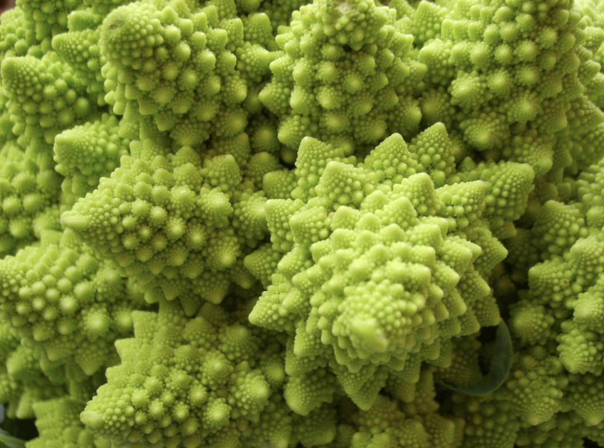
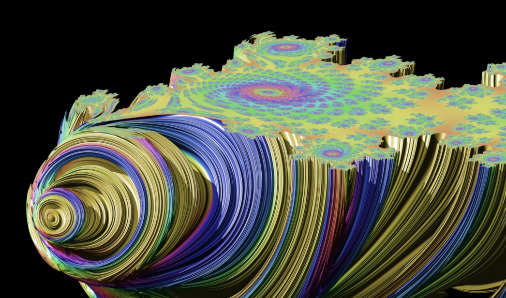

# Computer graphics project

fract’ol

##### _Summary: This project is meant to create graphically beautiful fractals._

_요약: 이 프로젝트의 목표는 그래픽적으로 아름다운 프랙탈을 만들어내는 것입니다._

##### _Version: 2_

_버전 2_

 

# Contents

| Chapter |                     Contents                     | page |
| :-----: | :----------------------------------------------: | :--: |
|    I    |            [**Foreword**](#Chapter-1)            |  2   |
|   II    |          [**Introduction**](#Chapter-2)          |  3   |
|   III   |           [**Objectives**](#Chapter-3)           |  4   |
|   IV    |      [**General Instructions**](#Chapter-4)      |  5   |
|    V    |    [**Mandatory part - fractol**](#Chapter-5)    |  6   |
|   VI    |           [**Bonus part**](#Chapter-6)           |  8   |
|   VII   | [**Submission and peer correction**](#Chapter-7) |  9   |

 

# Chapter 1

## Foreword

##### _Here’s what Wikipedia has to say on hydraulic fracturing:_

다음은 위키피디아에서 발췌해온 "수압 파쇄법"에 대한 설명입니다:

##### _The "hydraulic fracturing," is the targeted disruption of geological formations with low permeability by means of injection under high pressure of a fluid to micro-cracking and crack the rock. This fracturing can be performed near the surface or at depth (over 1 km or more than 4 km in the case of shale gas) and from vertical wells, sloped or horizontal._

"수압 파쇄법" 이란 고압의 유체를 미세한 틈새에 주입하여 광석을 파쇄하는 방식으로, 저투과성 지질을 파괴하는 표적 파괴 공법이다. 이 파쇄법은 지표면 근처 또는 (1km 또는 셰일 가스를 피하기 위해 4km 이상의) 깊이에서 수직, 경사면, 또는 수평으로 수행될 수 있다.

##### _This relatively old technique (1947), developed for conventional oil deposits, is renewed by its association with horizontal drilling (developed from 1980). It is the gradual mastery of the economic viability of this association for non-conventional deposits, who guided the recent development of the operation of these: it made available formerly inaccessible resources, or which have been exploited at exorbitant costs and slowly._

이 비교적 낡은 (1947년도) 기술은 기존에 매장된 석유를 파내기 위해 개발되었으며, 1980년대에 개발된 수평 시추를 접목시킨 덕에 더욱 발전할 수 있었다. 이는 비전통자원의 경제적 가능성을 열어주었으며, 이전에는 접근할 수 없었거나 터무니없이 비싼 비용 또는 엄청난 시간을 투자해야 얻을 수 있는 자원을 이용할 수 있게 함으로써 비약적인 발전을 이끌어내었다.

##### _It is carried out by fracturing the rock with a "stress" mécanique using a fluid injected under high pressure from a surface drilling, to increase the macro-porosity and the microporosity. The fluid could be the water, a slurry or a technical fluid whose viscosity was adjusted._

이 작업은 표면의 시추로부터 고압의 유체를 암석에 주입하여 기계적 응력으로 광석을 파쇄하는 방식으로 이루어지며, 암석의 거시 다공성과 미세 다공성을 증가시킨다. 이 작업은 물이나 슬러리 또는 적절한 점성의 유체 등을 사용할 수 있다.

##### _This project is not called fract’oil and accordingly has no relation to hydraulic fracturing._

사실 이 프로젝트의 이름은 fract'oil이 아니므로 수압 파쇄법과는 일말의 관련도 없습니다.

 

# Chapter 2

## Introduction

##### _The term fractal was first used by mathematician Benoit Mandelbrot in 1974, he based it on the Latin word fractus, meaning "broken" or "fractured"._

프랙탈이라는 단어는 1974년에 수학자 브누아 망델브로에 의해 처음으로 사용되었으며, 이 단어는 "부서진" 또는 "파열된" 이라는 뜻의 라틴어 `fractus`에서 유래하였습니다.

##### _A fractal is an abstract mathematical object, like a curve or a surface, which has a similar pattern whatever the scale._

프랙탈은 곡선이나 면과 같은 추상적인 수학적 객체이며, 어떤 배율에서도 비슷한 패턴을 가집니다.

##### _Various natural phenomena – like the romanesco cabbage – have some fractal features._

아래 사진의 로마네스코 브로콜리와 같이, 여러가지 자연 현상 속에서 프랙탈의 특징을 찾아볼 수 있습니다.

##### _Now, it’s your turn to generate some magnificent fractals!_

이제, 여러분이 직접 웅장한 프랙탈들을 창조해낼 차례입니다!

 

# Chapter 3

## Objectives

##### _Now that you took over your first graphical library: the `miniLibX`, it’s time for you to light all the pixels of your screen at the same time!_

드디어 여러분의 첫 번째 그래픽 라이브러리 `miniLibX`를 사용하여 화면에 픽셀들을 아름답게 빛내줄 시간이 왔습니다!

##### _This new project will be the opportunity for you to hone your `miniLibX` skills, to make you discover/use the mathematical notion of `complex numbers` and to take a peek at the concept of `optimization` in computer graphics._

이 새로운 프로젝트는 여러분에게 `miniLibX` 라이브러리 사용 능력을 기를 수 있을 뿐만 아니라, `복소수`라는 수학적 개념을 공부하고 사용할 수 있으며, 컴퓨터 그래픽에서 `최적화`의 개념을 엿볼 수 있는 좋은 기회가 될 것입니다.

 

##### _Don’t forget to watch the videos on e-learning!_

e-learning 영상 보고 오시는 거 잊지 마세요!

 

# Chapter 3

## General Instructions

- ##### _This project will be corrected by humans only. So, feel free to organize and name your files as you wish, but within the constraints listed here._

  이 프로젝트는 사람에 의해서만 채점됩니다. 따라서, 파일의 이름이나 폴더 위치는 자유롭게 구성하세요. 다만, 이곳에 나열된 조건들을 지키셔야 합니다.

- ##### _You cannot use global variables._

  전역 변수는 사용할 수 없습니다.

- ##### _You must code in C._

  C언어를 사용하여 프로그램을 작성하여야 합니다.

- ##### _Your project must follow `the Norm`._

  프로젝트는 `Norm` 규칙을 철저히 지켜야 합니다.

- ##### _You have to handle errors carefully. In no way can your program quit unexpectedly (Segmentation fault, bus error, double free, etc)._

  여러분은 반드시 오류를 세심하게 처리하셔야 합니다. 어떠한 이유 (Segmentation fault, bus error, double free 등) 에서도 프로그램이 예상치 못하게 종료되면 안 됩니다.

- ##### _Your program cannot have memory leaks._

  프로그램에 메모리 누수가 발생하면 안 됩니다.

- ##### _You must use the `miniLibX`. Either the version that is available on the operating system, or from its sources. If you choose to work with the sources, you will need to apply the same rules for your libft as those written above._

  반드시 `miniLibX`를 사용해야 합니다. (운영체제에서 이용 가능한 라이브러리와 과제에서 제공되는 소스 중 하나를 사용하셔야 합니다) 만약 제공받은 소스를 이용해 작업하기로 했다면, 위에 명시된 `Libft` 규칙과 같은 규칙을 따라야 합니다.

> 역주: 서브젝트 오류로 영문/불문 pdf의 어디에도 규칙이 명시되어 있지 않습니다.
> 타 서브젝트의 **Common Instructions**를 참고하시는 것을 추천드립니다.

 

# **Chapter 5**

## Mandatory part - fractol

| **프로그램 이름**            | `fractol`                                                                                                                                                                               |
| ---------------------------- | --------------------------------------------------------------------------------------------------------------------------------------------------------------------------------------- |
| **제출할 파일**              | `제작에 필요한 모든 파일들`                                                                                                                                                             |
| **Makefile 규칙**            | `all, clean, fclean, re, bonus`                                                                                                                                                         |
| **인자**                     |                                                                                                                                                                                         |
| **사용가능한  외부 함수** | - `open, close, read, write, printf, malloc, free, perror, strerror, exit`   - `math 라이브러리 내의 모든 함수들 (-lm man man 3 math)`   - `MinilibX 라이브러리 내의 모든 함수들` |
| **직접 만든 libft**          | `사용 가능`                                                                                                                                                                             |
| **설명**                     |                                                                                                                                                                                         |

 

##### _This project’s goal is to create a small fractal exploration program. Start by seeing what a fractal is._

이번 프로젝트의 목표는 작은 프랙탈 탐색 프로그램을 만드는 것입니다. 프랙탈이 무엇인지 알아보는 것부터 시작해 보세요.

##### _The constraints are as follows:_

제약조건은 다음과 같습니다:

- ##### _Your software should offer the Julia set and the Mandelbrot set._

  여러분의 프로그램은 쥘리아 집합과 망델브로 집합을 표현할 수 있어야 합니다.

- ##### _The mouse wheel zooms in and out, almost infinitely (within the limits of the computer). This is the very principle of fractals._

  마우스 휠을 이용하여 (컴퓨터의 성능이 받혀주는 한) 거의 무한히 확대 / 축소할 수 있어야 합니다. 이는 프랙탈의 기본 원칙에 따른 것이기도 하죠.

- ##### _You must use at least a few colors to show the depth of each fractal. It’s even better if you hack away on psychedelic effects._

  최소한 몇 가지 색상을 사용하여 각 프랙탈의 깊이를 표현하여야 합니다. 사이키델릭 효과를 제거하면 더 좋을 거에요.

- ##### _A parameter is passed on the command line to define what type of fractal will be viewed. If no parameter is provided, or if the parameter is invalid, the program displays a list of available parameters and exits properly._

프로그램을 실행할 때 어떤 타입의 프랙탈을 표현할 것인지 알려주는 인자가 함께 전달되어야 합니다. 인자가 입력되지 않았거나, 잘못된 인자가 들어왔을 경우 프로그램은 사용 가능한 인자 목록을 출력한 후 제대로 종료되어야 합니다.

- ##### _More parameters must be used for fractal parameters or ignored._

  다른 인자값들은 반드시 프랙탈의 인자로 사용되거나 무시되어야 합니다.

- ##### _You must be able to create different Julia set with the parameters of the program._

  프로그램에서 받은 인자를 토대로 서로 다른 쥘리아 집합을 생성하여야 합니다.

##### _As for the graphic representation:_

그래픽 표현에 대한 제약 조건은 다음과 같습니다:

- ##### _ESC will exit the program._

  ESC는 프로그램을 종료하여야 합니다.

- ##### _The use of images of the minilibX is strongly recommended._

  `minilibX`의 `images`를 사용하는 것을 강력히 추천합니다!

 

# **Chapter 5**

## Bonus part

##### _Here are some interesting ideas for the bonuses._

보너스를 위한 흥미로운 아이디어를 몇 개 드리죠.

- ##### _One more different fractal (there are more than a hundred different types of fractals referenced online)._

  다른 종류의 프랙탈 하나 더 구현하기 (인터넷 상에서 수백 개의 서로 다른 프랙탈 예제들을 찾을 수 있을 겁니다)

- ##### _The zoom follows the actual mouse position._

  확대 / 축소가 현재 마우스 위치를 따라가게 하기

- ##### _In addition to the zoom: moving with the arrows._

  확대 / 축소에 더해, 화살표 키로 화면 움직여 보기

- ##### _Make the color range shift._

  색상 범위 변경해 보기

 

 

# Chapter 5

## Submission and peer correction

- ##### _Submit your work on your `GiT` repository as usual. Only the work on your repository will be graded._

  항상 그래왔듯, 여러분의 결과물을 `GIT` 레포지토리에 제출하세요. 레포지토리에 있는 과제물만이 채점될 것입니다.

 

