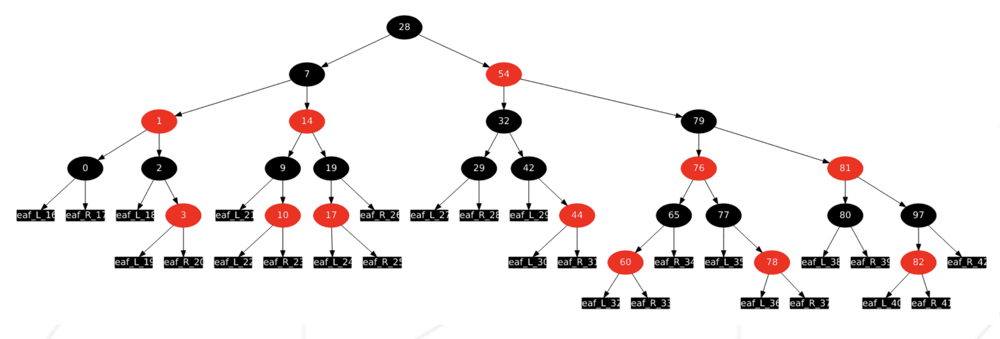

# ft_containers

**C++ containers, easy mode**

C++ 컨테이너, 이지 모드

#### _Summary: The standard C++ containers have all a specific usage._

_요약: 표준 C++ 컨테이너들은 각자 다른 용도로 사용됩니다._

#### _To make sure you understand them, let’s re-implement them!_

_컨테이너들을 확실히 이해하기 위해서, 한번 재구현해 봅시다!_

#### _Version: 5.2_

_버전 5.2_

 

# **Contents**

| Chapter | Contents                                     | Page |
| :-----: | :------------------------------------------: | :--: |
|    1    | [**Objectives**](#Chapter-1) | 2    |
|    2    | [**General Rules**](#Chapter-2)               | 3    |
|    3    | [**Mandatory Part**](#Chapter-3)           | 4    |
|    3.1    | [**Requirements**](#Chapter-3)           |  5   |
|    3.2    | [**Testing**](#Chapter-3)           | 6    |
|    4    | [**Bonus Part**](#Chapter-4)                   | 7    |
|    5    | [**Submissions and peer-evaluation**](#Chapter-5)                   | 8    |

 

# **Chapter 1**

## Objectives

#### _In this project, you will implement a few container types of the C++ standard template library._

이번 프로젝트에서는 C++ 표준 템플릿 라이브러리의 몇 가지 컨테이너 타입들을 구현해 볼 것입니다.

#### _You have to take the structure of each standard container as reference. If a part of the Orthodox Canonical form is missing in it, do not implement it._

각 표준 컨테이너의 구조를 참고하셔야 합니다. 만약 Orthodox Canonical form을 따르지 않은 부분이 있다면, 구현하지 마세요.

#### _As a reminder, you have to comply with the C++98 standard, so any later feature of the containers **MUST NOT** be implemented, but every C++98 feature (even deprecated ones) is expected._

다시 말하지만, C++98 표준을 따르셔야 합니다. 그 말인 즉슨, (사용되지 않는 = deprecated 된 기능들을 포함한) 모든 C++98 버전에서의 기능들이 구현되어 있어야 합니다. 이후에 나온 기능들은 **절대** 구현하지 마세요.

 

# **Chapter 2**

## General Rules

#### _Compiling_

**컴파일 관련 규칙**

- ##### _Compile your code with `c++` and the flags `-Wall -Wextra -Werror`_

  `c++` 와 `-Wall -Wextra -Werror` 플래그를 이용해서 컴파일하세요.

- ##### _Your code should still compile if you add the flag `-std=c++98`._

  여러분의 코드는 `-std=c++98` 플래그를 추가해도 컴파일이 되어야 합니다.

- ##### _You have to turn in a `Makefile` which will compile your source files. It must not relink._

  여러분의 코드를 컴파일할 `Makefile`을 함께 제출하세요. `Makefile`은 리링크되어서는 안 됩니다.

- ##### _Your `Makefile` must at least contain the rules: `$(NAME), all, clean, fclean and re`._

  `Makefile`은 최소한 `$(NAME), all, clean, fclean, re` 규칙을 포함해야 합니다.

#### _Formatting and naming conventions_

**형식과 이름 규칙**

- ##### _For each container, turn in the appropriately named class files._

  각 컨테이너마다, 적절하게 작명된 클래스 파일을 제출하세요.

- ##### _Goodbye Norminette! No coding style is enforced. You can follow your favorite one. But keep in mind that a code your peer-evaluators can’t understand is a code they can’t grade. Do your best to write a clean and readable code._

  _잘가요 Norminette!_ 어떠한 코딩 스타일도 강제되지 않습니다. 원하는 스타일로 자유롭게 코딩하세요. 다만, 평가자가 이해할 수 없는 코드는 점수를 줄 수 없는 코드입니다. 깨끗하고 읽기 쉬운 코드를 작성하기 위해 최선을 다하세요.

#### _Allowed/Forbidden_

**허용된 사항 / 허용되지 않은 사항들**

#### _You are not coding in C anymore. Time to C++! Therefore:_

여러분은 더 이상 C로 코딩하지 않습니다. C++을 사용할 시간입니다! 따라서,

- ##### _You are allowed to use everything from the standard library. Thus, instead of sticking to what you already know, it would be smart to use as much as possible the C++-ish versions of the C functions you are used to._

  표준 라이브러리의 모든 기능들을 사용할 수 있습니다. 따라서, 이미 알고 있는 지식만을 고수하기보다는, 익숙한 C 함수들 대신 C++ 함수들을 사용하여 구현하시는 것을 권장합니다.

- ##### _However, you can’t use any other external library. It means C++11 (and derived forms) and Boost libraries are forbidden. The following functions are forbidden too: `*printf()`, `*alloc()` and `free()`. If you use them, your grade will be 0 and that’s it._

  허나, 외부 라이브러리의 사용은 금지됩니다. 그 말인 즉슨, C++11 (및 파생 형식) 과 `Boost` 라이브러리는 사용하실 수 없습니다.  `*printf()`, `*alloc()`, `free()` 또한 사용 금지입니다. 이 중 하나라도 사용하였을 경우, 0점을 받게 될 것입니다.

#### _A few design requirements_

**디자인 요구 사항**

- ##### _Memory leakage occurs in C++ too. When you allocate memory, you must avoid memory leaks._

  C++에서도 메모리 누수 현상이 발생할 수 있습니다. 메모리를 할당한다면, 누수를 꼭 방지하셔야 합니다.

- ##### _Any function implementation put in a header file (except for function templates) means 0 to the exercise._

  함수 템플릿을 제외한 어떠한 함수라도 헤더에 구현되어 있을 경우, 0점을 받습니다.

- ##### _You should be able to use each of your headers independently from others. Thus, they must include all the dependencies they need. However, you must avoid the problem of double inclusion by adding include guards. Otherwise, your grade will be 0._

  필요하다면 헤더를 각각 다르게 만들어 사용해도 무방합니다. 각 헤더는 모든 의존성 헤더들을 불러오고 있어야 합니다. 허나, include guard를 사용하여 double inclusion 문제를 해결하지 않았다면 0점이 부여됩니다.

#### _Read me_

**읽어주세요**

- ##### _You can add some additional files if you need to (i.e., to split your code) and organize your work as you wish as long as you turn in the mandatory files._

  필수 파트의 내용을 전부 제출한다는 가정 하에, 임의의 파일을 추가하여 작업물을 정리하여도 괜찮습니다. (예시: 코드를 서로 다른 파일에 분리하는 등)

- ##### _By Odin, by Thor! Use your brain!!!_

  오딘의 힘으로, 토르의 힘으로! 머리를 굴려보세요!!!

> ⚠️ 
>
> ##### _Since your task here is to recode the STL containers, you of course cannot use them in order to implement yours._
>
> 이 과제의 목적은 STL 컨테이너를 작성하는 것이므로, 당연하지만 기존의 STL 컨테이너를 불러와 사용하실 수 없습니다.

 

# **Chapter 3**

## Mandatory Part

##### _Implement the following containers and turn in the necessary `<container>.hpp` files with a `Makefile`:_

  다음의 컨테이너를 구현하고, 필요한 `<container>.hpp` 와 `Makefile` 을 제출하세요 :

- #### `vector`

  ##### _You don’t have to do the `vector<bool>` specialization._

  `vector<bool>` 특수화는 구현하시지 않아도 됩니다.

- #### `map`

- #### `stack`

##### _It will use your vector class as default underlying container. But it must still be compatible with other containers, the STL ones included._

  `stack`을 구현하실 땐 여러분이 직접 제작한 `vector` 컨테이너를 기본 컨테이너로 사용하세요. 다만 STL 컨테이너 등, 다른 컨테이너들과도 호환이 되어야 합니다.

> ℹ️  
>
> ##### _You can pass this assignment without the stack (80/100). But if you want to do the bonus part, you have to implement the 3 mandatory containers: vector, map and stack._
>
> `stack`을 구현하지 않아도 과제 통과가 가능합니다 (80/100), 다만 보너스 파트를 작업하고 싶다면 3개의 필수 컨테이너 (`vector`, `map`, `stack`) 를 모두 구현하셔야 합니다.

##### _You also have to implement:_

다음의 함수들 또한 구현하여야 합니다:

- #### `std::iterator_traits`

- #### `std::reverse_iterator`

- #### `std::enable_if`
  ##### _Yes, it is C++11 but you will be able to implement it in a C++98 manner. This is asked so you can discover SFINAE._

  아시다시피, 이것은 C++11에서 추가되었습니다. C++98 형식으로 구현해 보세요. 이 기능을 구현함으로써 SFINAE에 관해 자세히 알아보실 수 있을 것입니다.

- #### `std::is_integral`

- #### `std::equal` and/or `std::lexicographical_compare`

- #### `std::pair`
- #### `std::make_pair`

 

# **Chapter 3.1**

## Requirements

- ##### _The namespace must be `ft`._

  네임스페이스는 `ft` 여야 합니다.

- ##### _Each inner data structure used in your containers must be logical and justified (this means using a simple array for map is not ok)._

  여러분의 컨테이너에서 사용하는 내부 자료 구조는 논리적이어야 하고, 정당한 이유가 있어야 합니다. (이 말인 즉슨, `map`을 구현하기 위해 단순한 배열을 사용하는 것은 금지되었다는 뜻입니다.)

- ##### _You cannot implement more public functions than the ones offered in the standard containers. Everything else must be private or protected. Each public function or variable must be justified._

  표준 컨테이너에 실재하는 public 함수 외에, 추가적인 public 함수를 구현하시면 안 됩니다. 모든 함수들은 private 또는 protected로 구현되어야 한다는 의미입니다. 모든 public 함수나 변수를 구현할 때는 정당한 이유가 있어야 합니다.

- ##### _All the member functions, non-member functions and overloads of the standard containers are expected._

  표준 컨테이너의 모든 멤버 함수, 비 멤버 함수와 오버로드들이 구현되어야 합니다.

- ##### _You must follow the original naming. Take care of details._

  원본 함수 / 변수의 이름을 따라 작명하여야 합니다. 디테일에 주의하세요.

- ##### _If the container has an iterator system, you must implement it._

  컨테이너에 이터레이터가 존재할 경우, 반드시 구현하여야 합니다.

- ##### _You must use `std::allocator`._

  `std::allocator` 를 반드시 사용하여야 합니다.

- ##### _For non-member overloads, the keyword `friend` is allowed. Each use of `friend` must be justified and will be checked during evaluation._

  비 멤버 오버로드는 `friend` 키워드 사용이 허용됩니다. 다만 모든 `friend` 사용은 합당한 이슈가 있어야 하며, 관련 사항이 평가 시간에 확인될 것입니다.

- ##### _Of course, for the implementation of `std::map::value_compare`, the keyword `friend` is allowed._

  당연하게도, `std::map::value_compare` 구현 시에는 `friend` 키워드를 사용할 수 있습니다.

> ℹ️  
>
> ##### _You can use [https://www.cplusplus.com/](https://www.cplusplus.com/) and [https://cppreference.com/](https://cppreference.com/) as references._
>
> [https://www.cplusplus.com/](https://www.cplusplus.com/) 와 [https://cppreference.com/](https://cppreference.com/) 를 참고 자료로 사용하실 수 있습니다.

 

# **Chapter 3.2**

## Testing

- ##### _You must also provide tests, at least a `main.cpp`, for your defense. You have to go further than the `main` given as example!_

  평가 디펜스를 위하여 반드시 `main.cpp` 와 같은 테스트를 제공하여야 합니다. 과제에 함께 제공된 `main` 예제보다 더 많은 테스트를 시도해 보세요!

- ##### _You must produce two binaries that run the same tests: one with your containers only, and the other one with the STL containers._

  여러분은 같은 테스트를 구동하는 두 개의 바이너리 파일을 제출하셔야 합니다. 하나는 여러분이 작성하신 컨테이너로 동작하여야 하고, 나머지 하나는 STL 컨테이너로 동작하여야 합니다.

- ##### _Compare outputs and performance / timing (your containers can be up to 20 times slower)._

  두 테스트의 속도와 성능을 비교해 보세요. (여러분의 컨테이너는 20배의 속도 차이까지 허용합니다.)

- ##### _Test your containers with: `ft::<container>`._

  여러분의 컨테이너를 `ft::<container>` 로 테스트해 보세요.

> ℹ️  
>
> ##### _A `main.cpp` file is available to download on the intranet project page._
>
> 인트라의 프로젝트 페이지에서 `main.cpp`를 다운로드할 수 있습니다.

 

# **Chapter 4**

## Bonus Part

##### _You will get extra points if you implement one last container:_

다음의 마지막 컨테이너를 구현하시면 추가 점수를 얻으실 수 있습니다:

- #### _set_

##### _But this time, a **Red-Black** tree is mandatory._

다만, 이 컨테이너를 구현하기 위해서 **Red-Black 트리** 구현은 필수입니다.

 

> ⚠️  
>
> ##### _The bonus part will only be assessed if the mandatory part is PERFECT. Perfect means the mandatory part has been integrally done and works without malfunctioning. If you have not passed ALL the mandatory requirements, your bonus part will not be evaluated at all._
>
> 보너스는 필수로 구현해야 하는 파트가 **완벽할 때**만 평가될 것입니다. '완벽함' 이란, 모든 필수 파트가 전부 구현되어 있어야 하며 오작동하는 부분이 없어야 함을 의미합니다. 필수로 구현해야 하는 파트에서 **만점**을 받지 못한다면, 보너스 항목은 채점되지 않습니다.

 

# **Chapter 5**

## Submission and peer correction

##### _Turn in your assignment in your `Git` repository as usual. Only the work inside your repository will be evaluated during the defense. Don’t hesitate to double check the names of your files to ensure they are correct._

항상 그래왔듯, 여러분의 결과물을 `GIT` 레포지토리에 제출하세요. 평가 중에는 레포지토리에 있는 과제물만이 채점될 것입니다. 파일의 이름이 틀리진 않았는지 반복적으로 체크하는 것을 잊지 마세요.

