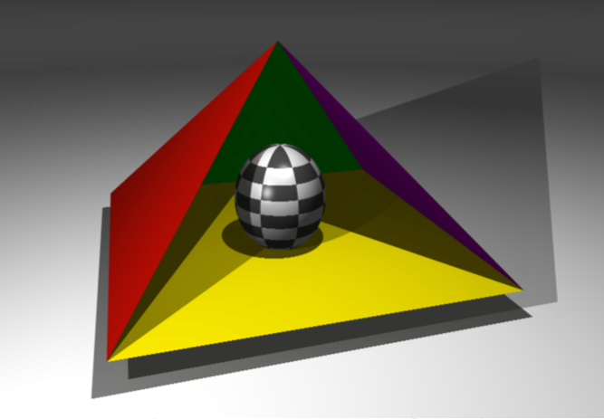

# miniRT

miniLibX 를 이용한 나의 첫 레이트레이서

> ## *요약*
>
> 이 프로젝트는 레이트레이싱의 아름다운 세계를 알아볼 수 있는 프로젝트입니다. 성공하고나면 간단한 컴퓨터 그래픽 이미지를 만들 수 있고 다시는 수학 공식에 절대 겁먹을 일이 없을 것 입니다.


## 목차

1. [들어가며](## 들어가며)

2. [기본 규칙](## 기본 규칙)

3. [필수 지침](## 필수 지침)

4. [보너스 지침](## 보너스 지침)

5. [예시](## 예시)


## 들어가며

삼차원 컴퓨터 그래픽을 생성하는 방법은 크게 두 가지가 있습니다. 하나는 효과적이어서 대부분의 그래픽 엔진에서 사용하는 **래스터리제이션 (Rasterization)** 이고, 다른 하나는 바로 **레이트레이싱 (Ray Tracing)** 입니다.

레이트레이싱 방식은 1968년 처음 개발되었고 (최근들어 많은 개선이 이루어졌다) 래스터리제이션 방식보다 훨씬 많은 연산이 필요합니다. 결과적으로 레이트레이싱은 실시간 사용에 적합하지 않지만, 훨씬 높은 정도로 현실함있는 이미지를 만드는 것이 가능합니다.

높은 수준의 그래픽을 만들기 위해서는 당연하게도 기본에 충실해야 합니다. `miniRT` 는 `C` 로 만들어진 기초적이고 기본적이지만 효과적인 첫 레이트레이서가 될 것입니다.

`miniRT` 의 주요 목적은 본인 스스로에게 수학자가 아니더라도 여러 수학 공식이나 물리 공식을 사용할 수 있다는걸 증명하는 것입니다. 레이트레이싱 기능의 가장 기본적인 기능만 구현할 것으로 진정하고 심호흡하고 절대 당황하지 마세요! 이 프로젝트가 끝나면, 클러스터에서 사용한 수 많은 시간들이 아주 멋진 사진으로 바뀌는 것을 볼 수 있을 것입니다.


## 기본 규칙

* 해당 프로젝트는 Norm 을 준수하며 작성해야 합니다. 만약 추가적인 파일이나 함수가 존재한다면, 해당 파일 또는 함수 역시 Norm 체크 대상에 해당하고 만약 Norm 에러가 존재한다면 **0** 점을 받게 될 것입니다.
* 해당 함수는 예상치 못한 행동으로 비정상적인 종료를 하면 안됩니다 (Segmentation fault, Bus error, Double free 등). 만약 비정상적인 종료를 하게 된다면 해당 프로젝트를 구현하지 못했다고 판단하고 평가 과정에서 **0** 점을 받게 될 것입니다.
* 힙 영역에 할당된 모든 메모리 공간은 반드시 적절한 방법으로 필요할 때 할당 해제해야 합니다. 메모리 누수는 용납되지 않습니다.
* 만약 해당 프로젝트에서 `Makefile` 을 요구한다면 반드시 소스 파일을 `-Wall -Wextra -Werror` 플래그를 이용해 컴파일하고 적절한 출력물을 만들 수 있는 `Makefile` 을 제출해야 합니다. 또한 `Makefile` 은 리링크 (relink) 되면 안됩니다.
* `Makefile` 은 반드시 최소한 `$(NAME)`, `all`, `clean`, `fclean` 의 규칙을 포함하고 있어야 합니다.
* 해당 프로젝트의 보너스를 제출하기 위해서는 반드시 `Makefile` 에 필수 지침에서 금지된 다양한 해더, 라이브러리, 금지된 함수를 포함하는 `bonus` 규칙을 만들어야 합니다. 보너스는 `_bonus.{c/h}` 의 다른 파일로 존재해야합니다. 필수 지침과 보너스 지침은 각각 개별로 평가됩니다.
* 만약 프로젝트에서 `libft` 사용을 허용한다면, 반드시 해당 소스와 그 소스 파일을 컴파일할 수 있는 독립된 `Makefile` 을 `libft` 폴더 안에 복사해야 합니다. 프로젝트의 `Makefile` 은 반드시 독립된 `libft` 의 `Makefile` 을 통해 `libft` 를 컴파일한 후 프로젝트를 컴파일해야 합니다.
* 우리는 여러분이 해당 프로젝트에 대한 테스트 프로그램을 만드는 것을 권장합니다. 해당 프로그램은 **제출되지 않고 평가되지도 않지만** 여러분과 동료의 프로그램을 쉽게 테스트할 수 있게 해줄겁니다. 해당 프로그램은 특히 평가받을 때 유용하게 사용될 것입니다. 또한, 평가를 받을 때, 동료의 테스트 프로그램을 평가에 사용할 수 있습니다.
* 반드시 할당된 깃 레포지토리에 프로그램을 제출하세요. 오직 깃 레포지토리에 올려진 프로그램만 평가될 것입니다. 만약 Deepthought 가 여러분의 프로그램을 평가하게 된다면, 여러분의 피어 평가가 이루어진 후 평가하게 될 것입니다. 만약 Deepthought 가 평가할 때 여러분의 프로그램 어느 부분에라도 에러가 있다면, 평가는 그 즉시 멈출 것입니다.


## 필수 지침

| 키                | 버킷                                                         |
| ----------------- | ------------------------------------------------------------ |
| 프로그램 이름     | `miniRT`                                                     |
| 제출해야 할 파일  | 모든 파일                                                    |
| `Makefile`        | `all`, `clean`, `fclean`, `re`, `bonus`                      |
| 전달 인자         | `*.rt` 형식의 장면 파일                                      |
| 외장 함수         | `open`, `close`, `read`, `write`, `malloc`, `free`, `perror`, `strerror`, `exit`, `math` 라이브러리의 모든 함수 (`-lm man man 3 math`), `MinilibX` 의 모든 함수 |
| `libft` 허용 여부 | 가능                                                         |
| 설명              | 이 프로그램의 목적은 레이트레이싱 방식을 이용해 이미지를 생성하는 것입니다. 컴퓨터 그래픽 이미지는 제작한 빛 시스템에서 간단한 기하학적 파일이 지정한 각각의 장면을 특정 시각과 특정 위치에서 바라본 장면입니다. |

지켜야 할 사항은 다음과 같습니다.

* `miniLibX` 를 **반드시** 사용해야 합니다. 다른 버전이 OS 에 깔려있거나 직접 받아올 수도 있습니다. 하지만 다른 버전을 사용하게 된다면, `libft` 와 같은 **기본 규칙**을 지켜야 합니다.

* 윈도우의 움직임은 반드시 부드러워야 합니다 (다른 윈도우로 전환할 때, 최소화할 때 등).

* 최소한 다섯가지의 물리 대상을 가져야 합니다 (평면, 구, 원기둥, 사각형, 삼각형).

* 여러 물체가 표현되는 경우, 모든 교차점과 물체 내부는 반드시 올바르게 처리되어야 합니다.

* 프로그램은 물체 고유의 속성을 재설정할 수 있어야 합니다 (구의 반지름, 사각형의 측면 길이나 원기둥의 폭과 넓이 등).

* 프로그램은 반드시 물체와 빛, 카메라의 회전이나 변화에 대한 처리를 해야합니다 (회전할 수 없는 구와 삼각형, 빛은 제외).

* 빛의 처리 : 부분 밝기, 확실한 그림자, 주변광 등을 처리해야 합니다 (물체는 절대 완전한 어둠속에 있지 않아요). 색이 있고 여러 조명이 있는 경우도 올바르게 처리되어야 합니다.

* 언젠가 **Deepthought** 가 이 프로젝트를 평가할 수 있는 눈을 갖게 되는 날을 위해서, 또는 레이트레이싱으로 렌더링된 아름다운 이미지를 갖고싶을 경우를 위해 두 번째 인자로 `--save` 를 받을 때 렌더링된 이미지를 *bmp* 형식으로 변환해 저장해야 합니다.

* 만약 두 번째 인자가 없다면, 프로그램은 다음 규칙에 따라 이미지를 새 창에 출력해야 합니다.

	* `<ESC>` 버튼을 누르면 창을 닫고 프로그램을 완벽히 종료해야 합니다.
	* 창 프래임의 빨간 색 십자 버튼을 누르면 창을 닫고 프로그램을 완벽히 종료해야 합니다.
	* 만약 장면에서 선언된 크기가 화면 해상도보다 크다면, 새 창의 크기는 현제 화면 해상도로 맞춰야 합니다.
	* 만약 하나 이상의 카메라가 있다면, 별도의 키를 지정해 카메라를 전환할 수 있어야 합니다.
	* `minilibX` 의 `images` 를 사용하는 것을 강력하게 권장합니다.

* 프로그램은 반드시 첫 번쨰 인자로 장면이 정의되어있는 `.rt` 확장자명의 파일을 받아야 합니다.

	* `.rt` 파일은 새 창의 크기와 렌더링된 이미지의 크기를 포함하고있습니다. 따라서 `miniRT` 는 어느 크기로든 이미지를 렌더링할 수 있어야 합니다.

	* 각 요소 유형은 하나 이상의 개행으로 구분합니다.

	* 각 요소 유형의 상세 내용은 하나 이상의 빈 칸으로 구분합니다.

	* 각 요소 유형은 파일 어디에든지 있을 수 있습니다.

	* 대문자로 정의된 요소들은 장면당 하나씩만 정의할 수 있습니다.

	* 각 요소의 첫 번째 정보는 유형 구별자 입니다 (하나 혹은 두 개의 문자로 이루어져 있습니다). 그 뒤로 모든 구체적인 정보들이 다음과 같은 엄격한 규칙을 통해 작성됩니다.

		* 해상도

			```rt
			R	1920	1080
			```

			* 구별자 : **R**
			* **x** 렌더링 사이즈
			* **y** 렌더링 사이즈

		* 주변광

			```rt
			A	0.2	255,255,255
			```

			* 구별자 : **A**
			* 범위 내 주변광 비율 [0.0, 1.0] : **0.2**
			* R,G,B 색 범위 [0, 255] : **255, 255, 255**

		* 카메라

			```rt
			c	-50.0,0,20	0,0,1	70
			```

			* 구별자 : **c**
			* 시점의 x, y, z 좌표 : **0.0, 0.0, 20.6**
			* 정규화된 삼차원 방향 벡터. 각 x, y, z 축 마다 [-1, 1] 의 범위를 가짐 : **0.0, 0.0, 1.0**
			* FOV : 수평 시야 범위 [0, 180]

		* 빛

			```rt
			l	-40.0,50.0,0.0	0.6	10,0,255
			```

			* 구별자 : `l`
			* 광원의 x, y, z 좌표 : **0.0, 0.0, 20.6**
			* 빛의 밝기 비율 [0.0, 1.0] : **0.6**
			* R,G,B 색 범위 [0, 255] : **10, 0, 255**

		* 구

			```rt
			sp	0.0,0.0,20.6	12.6	10,0,255
			```

			* 구별자 : `sp`
			* 구 중심의 x,y,z 좌표 : **0.0, 0.0, 20.6**
			* 구의 반지름 : **12.6**
			* R,G,B 색 범위 [0, 255] : **10, 0, 255**

		* 평면

			```rt
			pl	0.0,0.0,-10.0	0.0,1.0,0.0	0,0,225
			```

			* 구별자 : `pl`
			* x,y,z 좌표 : **0.0, 0.0, -10.0**
			* 정규화된 삼차원 방향 벡터. 각 x, y, z 축 마다 [-1, 1] 의 범위를 가짐 : **0.0, 0.0, 1.0**
			* R,G,B 색 범위 [0, 255] : **0, 0, 255**

		* 정사각형

			```rt
			sq	0.0,0.0,20.6	1.0,0.0,0.0	12.6	255,0,255
			```

			* 구별자 : `sq`
			* 정사각형 중심의 좌표 : **0.0, 0.0, 20.6**
			* 정규화된 삼차원 방향 벡터. 각 x, y, z 축 마다 [-1, 1] 의 범위를 가짐 : **1.0, 0.0, 0.0**
			* 한 변의 길이 : **12.6**
			* R,G,B 색 범위 [0, 255] : **255, 0, 0**

		* 원기둥

			```rt
			cy	50.0,0.0,20.6	0.0,0.0,1.0	10,0,255	14.2	21.42
			```

			* 구별자 : `cy`
			* x,y,z 좌표 : **50.0, 0.0, 20.6**
			* 정규화된 삼차원 방향 벡터. 각 x, y, z 축 마다 [-1, 1] 의 범위를 가짐 : **0.0, 0.0, 1.0**
			* 원기둥의 직경 : **14.2**
			* 원기둥의 높이 : **21.42**
			* R,G,B 색 범위 [0, 255] : **10, 0, 255**

		* 삼각형

			```rt
			tr	10.0,20.0,10.0	10.0,10.0,20.0	20.0,10.0,10.0	0,0,255
			```

			* 구별자 : `tr`
			* 첫 번째 점의 x,y,z 좌표 : **10.0, 20.0, 10.0**
			* 두 번째 점의 x,y,z 좌표 : **10.0, 10.0, 20.0**
			* 세 번째 점의 x,y,z 좌표 : **20.0, 10.0, 10.0**
			* R,G,B 색 범위 [0, 255] : **0, 255, 255**

	* 필수 부분의 간단한 장면 파일 `.rt` 의 예시

		```rt
		R	1920 1080
		A	0.2											255,255,255
		
		c	-50,0,20		0,0,0		70
		l	-40,0,30					0.7				255,255,255
		
		pl	0,0,0			0,1.0,0						255,0,225
		sp	0,0,20						20				255,0,0
		sq	0,100,40		0,0,1.0		30				42,42,0
		cy	50.0,0.0,20.6	0,0,1.0		14.2	21.42	10,0,255
		tr	10,20,10		10,10,20	20,10,10		0,0,255
		```

	* 만약 세부사항의 일부가 잘못 입력되거나 입력되지 않았다면 프로그램은 적절히 종료해야 하고 `"Error\n"` 을 출력한 후 별도로 지정한 명확한 에러 메시지를 출력해야 합니다.

	* 동료평가를 받을 때, 요소 생성을 원할하게 하기 위해 각 기능에 맞는 장면을 모아서 평가를 받는 것이 이상적인 방법입니다.


## 보너스 지침

명백하게 **레이트레이싱** 기술은 반사, 투명도, 굴절, 복잡한 물체, 부드러운 그림자, caustics, 광원 (global illumination), 범프 매핑 (bump mapping), `.obj` 파일 렌더링 등 많은 것들을 처리할 수 있습니다.

하지만 `miniRT` 프로젝트에서는, 첫 레이트레이싱, `CGI` 로의 첫 발자국을 남기는 프로젝트인 만큼 최대한 간단함을 지키고 싶었습니다.

그래서 여기 적용해볼 수 있는 간단한 몇 가지 보너스 리스트를 준비했습니다. 만약 더 큰 보너스를 원한다면, 우리는 이 작은지만 유용한 것 부터 처리한 후 나중의 개발자 생활에서 새로운 레이트레이서를 코딩하라고 강력하게 조언해줄 수 있습니다.


Figure 4.1 : 범프 매핑을 활용한 빛나는 지구 텍스처를 갖고 있는 구체

> ### 주의!
>
> 보너스는 필수 지침이 **완벽** 해야 평가가 진행됩니다. **완벽** 하다는 것은 잘못된 방법으로 프로그램을 실행시켜도 실행에 실패하면 안된다는 것입니다. 기본적으로, 필수 지침을 채점하는 동안 **모든** 점수를 받지 못한다면, 보너스 부분은 평가에서 완전히 **무시** 된다는 것 입니다.

보너스 리스트 :

* Normal disruption e.g. using sine which gives a wave effect.
* Color disruption: checkerboard.
* Color disruption: rainbow effect using object’s normal.
* 직선 방향의 평행 조명.
* 요소의 조합 : 큐브 (6개의 정사각형).
* 요쇼의 조합 : 피라미드 (4개의 삼각형과 1개의 정사각형).
* 사이즈가 재한된 원기둥에 모자 씌우기.
* One other 2nd degree object: 원뿔, 쌍곡면, 포물면..
* 하나의 색 필터 : 세피아 필터, RGB 필터 등..
* 안티앨리어싱.
* 간단한 입체경 (빨강/초록 셀로판지 안경같은)
* 멀티스레드를 활용한 렌더링.
* 구면 텍스처링: uv 매핑.
* 범프 맵 텍스터 처리하기.
* 아름다운 관람석 (A beautiful skybox).
* 키보드를 활용해 카메라 이동하고 회전시키기.
* 키보드를 활용해 물체 이동하고 회전시키기.
* 마우스를 이용해 카메라 각도 바꾸기.

> ### 정보
>
> 평가 중 다른 함수를 사용하는 것이 정당하다고 판단되면, 다른 함수를 사용하는 것이 허용됩니다. 또한 원하는 장면 파일 형식을 필요에 맞게 바꿀 수 있습니다. 영리해지세요!

>### 팁
>
>모든 보너스 포인트를 얻기 위해서는 리스트 내용 중 14개만 확인하면 됩니다. 잘 선택하고 시간을 낭비하지 않게 조심하세요!


## 예시


Figure 5.1 : 하나의 구, 하나의 광원, 약간의 반짝임 (선택적)


Figure 5.2 : 하나의 원기둥, 하나의 광원


Figure 5.3 : 하나의 원뿔 (선택적) , 하나의 평면, 하나의 광원


Figure 5.4 : 두 평면을 포함한 모든 것


Figure 5.5 : 같은 장면, 다른 카메라


Figure 5.6 : 그림자까지


Figure 5.7 : 다양한 광원


Figure 5.8 : 평면, 세 개의 삼각형, 한 개의 정사각형, 그리고 하나의 낮은 밝기의 왼쪽 광원




Figure 5.9 : 여러 개의 광원과 반짝이는 채크무늬 구가 포함된 이미지