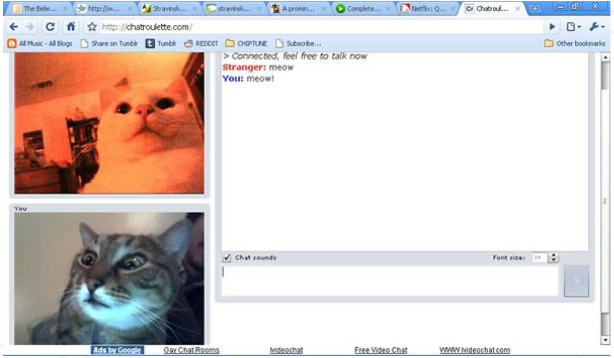

# **D09 - Piscine Python-Django**

## 쟝고 - AJAX - 웹소켓

_요약: 오늘은 한번 AJAX와 웹소켓을 쟝고에서 다루는 법을 배워봅시다._

##### _번역 오류 및 오역 제보는 42seoul_club_translate 채널 또는 @jiychoi 로 연락주세요._

 

# Contents

| Chapter | Contents                                 | page |
| :-----: | :--------------------------------------- | :--: |
|    1    | [**Preamble**](#Chapter-1)               |  2   |
|    2    | [**Instructions**](#Chapter-1)           |  3   |
|    3    | [**Today's specific rules**](#Chapter-2) |  4   |
|    4    | [**Exercise 00**](#Chapter-3)            |  5   |
|    5    | [**Exercise 01**](#Chapter-4)            |  7   |
|    6    | [**Exercise 02**](#Chapter-5)            |  9   |
|    7    | [**Exercise 03**](#Chapter-6)            |  10  |
|    8    | [**Exercise 04**](#Chapter-7)            |  11  |

 

# **Chapter 1**

## Preamble

 

`Chat`

고양이 (Felis catus) 는 작은 육식 포유류입니다. 고양이는 같은 고양잇과 동물들 중에서 유일하게 가축으로서 길러진 종으로, 따라서 야생 동족들과 구분하기 위해 집고양이로 구분하여 부르기도 합니다. 고양이는 집고양이, 농장 고양이나 길고양이로 구분되며, 후자로 갈 수록 자유분방하고 사람과 거리를 많이 둡니다. 집고양이는 사람과의 교류와 쥐를 잡는 능력 등 덕분에 역사적으로도 고평가받는 반려동물이지요. 현재 약 60 종류의 고양이 품종이 혈통에 따라 관리되고 있습니다.

[출처](https://en.wikipedia.org/wiki/Cat)

사진 1.1 냥카오톡 (Chatroulette) 에서 떠드는 (Chatting) 고양이 (Cat)

> ⚠️  
> 대체 왜 고양이를 언급했냐구요? 원본 과제는 프랑스어로 작성되었고, 고양이는 프랑스어로 Chat이기 때문입니다. 말장난이에요. 아시겠어요? Maudits Français!

 

# **Chapter 2**

## Instructions

 

노골적인 모순이 없는 이상, 해당 지침은 Python Django Piscine 모든 날짜에 적용됩니다.

- 이 페이지에 있는 내용만이 레퍼런스로 적용됩니다. 루머를 믿지 마세요!

- 조심하세요! 과제를 제출하기 한 시간 전까지도 해당 문서는 변경될 수 있습니다.

- 이번 과제들은 난이도별로 배치되어 있습니다 - 쉬운 것부터 어려운 것 까지요. 만약 쉬운 과제가 제대로 작동하지 않으면, `우리는 절 대` 어려운 과제를 (완벽하게 구현하였더라도) 채점하지 않을 것입니다.

- 파일과 디렉토리에 적절한 권한 설정을 해 주었는지 확인하세요.

- 각 과제별로 **제출 필수사항**을 지키셔야 합니다.

- 여러분의 과제는 같은 피씨너들에게 채점받고 점수가 매겨질 것입니다.

- 그리고 그 뒤에, 뮬리넷이라는 프로그램에 의해 채점되고 점수가 매겨질 것입니다. 뮬리넷은 여러분의 과제를 정말 엄격하고 꼼꼼하게 채점할 것입니다. 또한 모든 작업은 자동으로 진행되므로, 여러분이 뮬리넷과 협상하는 것은 불가능합니다. 좋지 못한 결과를 깜짝 선물로 받고 싶지 않다면, 철저히 과제에 임하세요.

- 쉘 과제들은 `/bin/sh`에 의해 실행될 수 있어야 합니다.

- 여러분은 **절대로** 명시된 제출 파일 외의 다른 파일들을 폴더 내에 남겨두시면 **안됩니다.**

- 질문 있으세요? 오른쪽 동료에게 물어보세요. 아니면 왼쪽 동료한테 물어보세요.

- 여러분이 참고할 만한 가이드는 `Google / man / 인터넷` 등이 있습니다.

- 인트라나 슬랙의 피씬 채널에서 토의하는 것을 잊지 마세요!

- 예시를 꼼꼼히 살펴보세요. 과제에 명시되지 않은 상세한 부분들이 들어있을 수도 있으니까요..

 

# Chapter 3

## Today's specific rules

- 여러분이 사용가능한 유일한 자바스크립트 라이브러리는 `JQuery` 입니다.

- day07부터 그래왔듯, 이번 서브젝트 (day09) 또한 하나의 단일 쟝고 프로젝트로 구성되어 있어야 하며, ex00 ex01... 처럼 분리하지 않아도 됩니다. 각 과제는 프로젝트에 새로운 기능을 추가할 뿐이며, 각 기능이 제대로 구현되었는지에 따라 점수를 드릴 거에요.

- 기본적인 관리자 어플리케이션 (default administration application) 은 남겨두어야 합니다.

- 이 프로젝트를 위해 만들어진 requirement.txt를 (pip freeze 커맨드를 이용하여 작성해서) 제출해야 합니다. 당연히 requirement.txt에는 프로젝트에서 필요한 라이브러리들을 전부 수록해야겠지요.

 

# Chapter 4

## Exercise 00

 

| **Piscine**                        | Exercise 00 |
| ---------------------------------- | ----------- |
| Exercise 00 : Ajax, 나의 공식이여! |
| **제출할 폴더**                    | ex00/       |
| **제출할 파일**                    |             |
| **허용되는 함수**                  |             |

 

`d09`라는 프로젝트를 만드시고, 안에 `account`라는 어플리케이션을 작성하세요.

해당 과제의 목표는 `AJAX`만을 이용하여 연결/연결 해제 시스템을 구현하는 겁니다.

이 어플리케이션에서, 컨텍스트의 종류에 따라 다음과 같은 두 가지 동작을 취하는 `127.0.0.1:8000/account` URL을 구현하세요:

- 유저가 연결되어 있지 않을 때: 페이지는 표준 연결 폼 (로그인 아이디와 패스워드 입력창) 을 보여주어야 합니다. 요지는 서버와의 커뮤니케이션에서 `AJAX`만을 사용해야 하고, `POST` 타입을 통해 연결되어야 한다는 점입니다.

  제출한 폼이 유효하지 않을 경우, 에러가 페이지에 나타나야 합니다.

  제출한 폼이 유효할 경우, 폼이 사라지고 다른 동작 (유저가 연결되어 있을 때 취하는 동작) 이 실행되어야 합니다.

  앞의 두 조건은 당연히, 새로고침 없이 바로 화면상에 나타나야 합니다!

- 유저가 연결되어 있을 때: 다음과 같은 텍스트를 화면에 보여주어야 합니다: `Logged as <user>`. <user\>은 당연히 현재 로그인된 유저명이 표시되어야 하겠지요? `로그아웃` 버튼도 함께 화면상에 띄워져야 합니다.

  이 버튼 (로그아웃 버튼) 또한 `AJAX`와 `POST` 메소드만으로 서버와 통신하여야 합니다.

  한번 로그아웃되면, 해당 텍스트와 로그아웃 버튼은 화면에서 사라져야 하고, 페이지는 다른 동작 (유저가 연결되지 않았을 때의 동작) 을 취하여야 합니다.

  이 동작 또한 새로고침 없이 화면에 변화가 바로 보여져야 합니다.

페이지를 '수동으로' 새로고침 하였을 땐, 새로고침 하기 전의 동작을 수행해야 합니다. (에러 표시는 제외됩니다.)

부트스트랩을 사용해도 됩니다.

> 💡  
> AuthenticationForm은 무료로 해줍니다!

 

# Chapter 5

## Exercise 01

 

| **Piscine**               | Exercise 01 |
| ------------------------- | ----------- |
| Exercise 01 : 간단한 채팅 |
| **제출할 폴더**           | ex01/       |
| **제출할 파일**           |             |
| **허용되는 함수**         |             |

 

`chat` 이라는 이름의 어플리케이션을 생성하세요.

이 어플리케이션에서는, 링크 세 개를 보여주는 페이지를 하나 생성하세요. 각 링크는 서로 다른 `chatroom`으로 연결됩니다.

각 채팅방의 이름은 데이터베이스상에 존재해야 합니다. 이를 위한 모델을 꼭 만드셔야 해요.

각 링크는 통상적으로 생각할 수 있는 채팅 기능이 구현된 페이지로 연결되어야 합니다. 채팅이라 함은 다음과 같은 기능을 구현해야 합니다:

- `Jquery`를 프론트엔드 라이브러리로 사용하고, `Websockets`를 서버와의 통신에 사용해야 합니다. (AJAX 쓰지 마세요.)

- 연결된 유저에게만 접근가능하여야 합니다.

- 채팅방의 이름이 어딘가에 표시되어야 합니다.

- 여러 유저들이 연결할 수 있어야 합니다. _(혹시 모르니까요..)_

- 유저는 메시지를 보낼 수 있어야 합니다. _(당연하죠. 그쵸?)_

- 유저가 보낸 메시지는 해당 채팅방에 접속한 다른 유저들에게 모두 보여야 합니다. _(채팅방 다들 써 보셨잖아요. 그쵸? 서문 (Preamble) 읽어보고 오신 것 맞죠?)_

- 새로운 메시지는 무조건 밑에 표시되어야 하고, 오름차순으로 정렬되어야 합니다. _(여러분을 위한 기능이에요. 맞아요. 아무튼 그렇습니다.)_ 또한 메시지 옆에 작성자의 이름도 표시되어야 해요.

- 메시지는 사라지면 안됩니다. 이전 메시지를 대체 (replace) 해도 안 됩니다. 메시지 순서가 바뀌면 안 됩니다.

- 유저가 채팅방에 들어오면, `<username> has joined the chat` 이라는 메시지가 표시되어야 하며, 채팅방 내의 모든 유저 (방금 접속한 유저도 포함) 에게 보여져야 합니다. 당연히, <username\>은 방금 접속한 유저의 유저명으로 대체되어야죠.

 

# Chapter 6

## Exercise 02

 

| **Piscine**        | Exercise 02 |
| ------------------ | ----------- |
| Exercise 02 : 역사 |
| **제출할 폴더**    | ex02/       |
| **제출할 파일**    |             |
| **허용되는 함수**  |             |

 

이번 과제에서는, 방금 만들었던 채팅방에 메시지 히스토리 기능을 추가해서 발전시켜 봅시다.

새로운 유저가 채팅방에 참가했을 때, 해당 유저는 직전까지 `채팅방에` 전송되었던 3개의 채팅 메시지를 (예전 메시지부터 최근 메시지 순으로, 위아래로) 볼 수 있어야 합니다.

다시 말하지만, 프론트엔드 라이브러리로는 `JQuery`만 사용가능하고, 서버와의 통신으론 `Websocket`만을 사용해야 하는 것을 잊지 마세요.

> 💡  
> 다른 것보다도, 기능부터 제대로 돌아가게 구현하세요. 최적화는 아직.. 생각하지 않으셔도 됩니다.

 

# Chapter 7

## Exercise 03

​
 

| **Piscine**              | Exercise 03 |
| ------------------------ | ----------- |
| Exercise 03 : 유저리스트 |
| **제출할 폴더**          | ex03/       |
| **제출할 파일**          |             |
| **허용되는 함수**        |             |

 

이번 과제에서는, 직전까지 만든 채팅에 로그인한 유저 목록과 시간 등을 표시하고, 스스로 업데이트하는 기능을 추가해 봅니다.

유저가 채팅방에 연결하면, 해당 유저는 현재 로그인된 다른 유저들을 확인할 수 있어야 합니다. (물론 그 목록에는 자기 자신도 포함되어야겠죠.)

유저 리스트는 메시지 리스트 옆에 제대로 표시되어야 합니다. (<div\> 태그나 다른 html 컨테이너 등을 이용해서요.)

유저가 채팅방에서 나가면, 해당 유저의 이름은 리스트에서 사라져야 하며, 메시지 하단에 `<username> has left the chat`이라는 텍스트를 보여야 합니다. (<username\>은 방금 접속 해제한 유저의 이름이 되겠죠.)

또 다시 한번 말하지만, `JQuery`만을 프론트엔드 라이브러리로 사용가능하고, `Websocket`만을 서버와의 통신에 사용해야 합니다.

 

# Chapter 8

## Exercise 04

​
 

| **Piscine**          | Exercise 04 |
| -------------------- | ----------- |
| Exercise 04 : 스크롤 |
| **제출할 폴더**      | ex04/       |
| **제출할 파일**      |             |
| **허용되는 함수**    |             |

 

채팅방이 고정된 사이즈의 공간 (컨테이너) 에 표시되도록 하세요. 메시지 개수가 컨테이너의 크기를 넘어갈 경우, 초과한 메시지는 컨테이너 위로 숨겨져야 하고, 스크롤 바가 표시되어야 합니다.

스크롤바는 항상 맨 아래를 가리키고 있어야 하며, 따라서 가장 최신 메시지가 앞에 보여야 합니다.
